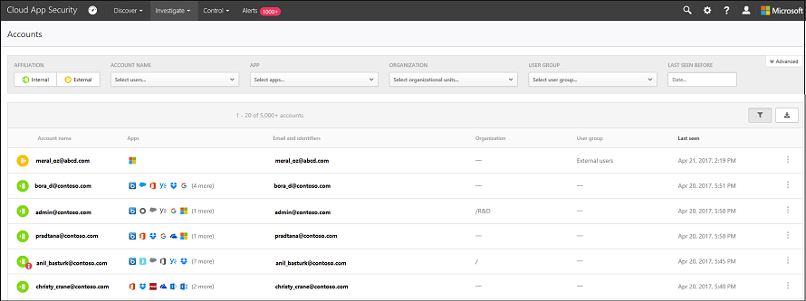

# Учетные записи
Cloud App Security информирует вас об учетных записях в подключенных приложениях. После подключения Cloud App Security к приложению с помощью соединителя приложений Cloud App Security считывает сведения об учетной записи, связанные с подключенными приложениями. На странице "Учетные записи" вы можете изучить эти учетные записи, разрешения, группы, в которые они входят, их псевдонимы и используемые приложения. Кроме того, когда Cloud App Security обнаруживает новую учетную запись, которая ранее не использовалась в подключенных приложениях, например в действиях или для организации общего доступа к файлам, такая учетная запись добавляется в список учетных записей этого приложения. Так вы сможете увидеть, какие действия внешние пользователи выполняют с вашими облачными приложениями.

Применив фильтр на странице **Учетные записи**, вы сможете найти конкретные учетные записи и подробные сведения о различных типах учетных записей, например сможете найти все внешние учетные записи, которые не использовались в течение последнего года. 

На странице **Учетные записи** вы можете проанализировать проблемы с учетными записями, включая следующие:  

-   Проверьте, были ли какие-либо из учетных записей неактивными в определенной службе в течение длительного времени (возможно, следует отозвать пользовательскую лицензию для этой службы)  
-   Вы можете отфильтровать пользователей с разрешениями администратора.  

-   Вы можете найти пользователей, которые больше не входят в вашу организацию, но учетные записи которых до сих пор активны.  

-   Вы можете применять к учетным пользователям действия управления, например приостановить приложение или перейти на страницу параметров учетной записи. Полный список действий управления см. в [журнале управления](governance-actions.md).
    
-   Вы можете просмотреть, какие учетные записи включены в каждую группу пользователей.  

-   Вы можете просмотреть, к каким приложениям получает доступ каждая учетная запись и какие приложения удаляются у определенных учетных записей.
    

## Фильтры учетных записей
Ниже приведен список фильтров учетных записей, которые можно применить. Большинство фильтров поддерживает несколько значений, а также значение NOT, предоставляя мощное средство создания политик.  
  
- **Имя учетной записи**: имя учетной записи — это первичный псевдоним пользователя, но прочие идентификаторы из других учетных записей Майкрософт (Office 365 и Azure Active Directory), например прокси-адреса, псевдонимы, идентификаторы безопасности, поддерживаются и консолидируются под первичным псевдонимом.

- **Принадлежность**: принадлежность может быть **внутренней** или **внешней**. Чтобы указать, какие пользователи и учетные записи являются внутренними, убедитесь, что в разделе **Параметры** задан **Диапазон IP-адресов** внутренней организации. Если у учетной записи есть разрешения администратора, значок в таблице "Учетные записи" отобразится как красный .

- **Приложение**: вы можете отфильтровать любое подключенное приложение API, которое используется учетными записями в вашей организации.

- **Домен**: позволяет отфильтровать пользователей в определенных доменах.

- **Последний просмотр**: фильтр **последний просмотр** позволяет найти неактивные учетные записи, пользователи которых не выполняли действия некоторое время.

- **Организация или подразделение**: позволяет отфильтровать участников заданных групп организации, которые были определены в подключенных приложениях.

- **Группа пользователей**: позволяет отфильтровать участников групп пользователей в Cloud App Security, как встроенных, так и импортированных.

## См. также  
[Ежедневные мероприятия для защиты облачной среды](daily-activities-to-protect-your-cloud-environment.md)   

[Клиенты с поддержкой Premier также могут выбрать Cloud App Security непосредственно на портале Premier.](https://premier.microsoft.com/)  
  
  