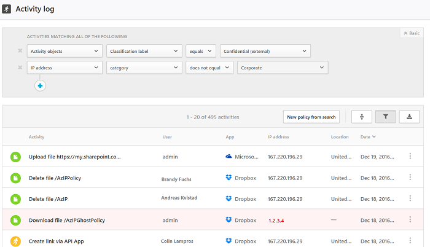

# Действия
Cloud App Security информирует вас обо всех действиях, связанных с подключенными приложениями. После подключения Cloud App Security к приложению с помощью соединителя приложений Cloud App Security сканирует все произошедшие действия (интервал времени сканирования предыдущего периода зависит от приложения), а затем непрерывно получает новые действия в обновлениях. 

> [!NOTE] 
> Полный список действий Office 365, отслеживаемых с помощью Cloud App Security, см. в статье [Поиск по журналу аудита в Центре безопасности и соответствия требованиям Office 365](https://support.office.com/article/Search-the-audit-log-in-the-Office-365-Security-Compliance-Center-0d4d0f35-390b-4518-800e-0c7ec95e946c?ui=en-US&rs=en-US&ad=US#ID0EABAAA=Audited_activities).

**Журнал действий** можно отфильтровать, если нужно найти конкретные действия. Вы можете создавать политики на основе действий, а затем указать, что будет вызывать создание оповещений. Кроме того, вы можете искать действия, выполненные с определенными файлами. Тип действий и информация, получаемая о каждом из них, зависят от приложения и типа данных, которые может предоставить приложение. 

Например, в **журнале действий** можно найти пользователей вашей организации, которые используют устаревшие операционные системы или браузеры: для этого после подключения приложения к Cloud App Security на странице **Activity log** (Журнал действий) воспользуйтесь расширенным фильтром и выберите **User agent tag** (Тег агента пользователя). Затем выберите пункт **Устаревший браузер** или **Устаревшая операционная система**.

 

Если вы хотите проверить, обращается ли кто-то к **конфиденциальным** файлам за пределами вашей организации, укажите в фильтре **Activity object** (Объект действия) поиск по **Classification label** (Метке классификации) и выберите метку **Confidential** (Конфиденциальные). Укажите в фильтре **IP address** (IP-адрес) поиск по **Category** (Категории) и исключите IP-адреса вашей организации (категории IP-адресов можно настроить в меню **Settings** (Параметры)). Щелкните **New policy from search** (Создать политику из поискового запроса), чтобы создать политику обработки действий на основе заданных фильтров и автоматически уведомлять пользователей.

 

 
В базовом фильтре доступны отличные инструменты для начала фильтрации действий.

 

Чтобы перейти к более конкретным действиям, разверните базовый фильтр и нажмите кнопку "Расширенный".

 

## Фильтры действий
Ниже приведен список доступных фильтров действий. Большинство фильтров поддерживает несколько значений, а также значение NOT, чтобы предоставить вам эффективный инструмент для создания политик.  
  
-   Идентификатор действия. Поиск только определенных действий по их идентификаторам. Этот фильтр очень удобен, если вы подключаете Cloud App Security к SIEM (с помощью агента SIEM) и хотите проанализировать оповещения на портале Cloud App Security.  
  
-   Объекты действий — поиск объектов, к которым было применено действие. Этот фильтр применяется к объектам файлов, папок, пользователей или приложений. 
    - Идентификатор объекта действия — идентификатор объекта (файла, папки, пользователя или приложения).
    - Файл, папка или URL-адрес сайта — позволяет выбрать файлы, папки и URL-адреса, которые начинаются с определенной строки.
    - Целевой объект (файл или папка) — позволяет выбрать определенный файл или папку. 
    - Элемент — позволяет искать по имени или идентификатору любого объекта действия (например, по именам пользователей, файлам, параметрам, сайтам). Для фильтра **Activity object Item** (Элемент объекта активности) можно выбрать, какие элементы следует отфильтровать: **содержащие** конкретный элемент, **равные** ему или **начинающиеся** с него.
    
-   Тип действия — поиск действия приложения.

-   Административное действие — поиск только административных действий.  
  
-   Идентификатор оповещения — поиск оповещения по идентификатору.

-   Приложение — поиск только действий в конкретных приложениях.  
  
-   Примененное действие — поиск по примененному действию управления: блокировка, обход прокси-сервера, расшифровка, шифрование, сбой шифрования, никаких действий.

-   Дата — дата, когда произошло действие. Фильтр поддерживает значения до и после наступления указанной даты, а также диапазон дат.  
  
-   Описание — определенное слово в описании действия, например все действия, содержащие строку **user** в описании.  
  
-   Тег устройства — поиск совместимых, управляемых или проверенных устройств.

-   Тип устройства — поиск только тех действий, которые были выполнены с использованием определенного типа устройства, например все действия с мобильных устройств, компьютеров или планшетов.  
  
-   IP-адрес — необработанный IP-адрес, категория или тег, с/из которых было выполнено действие.  
    - Необработанный IP-адрес — позволяет искать действия, выполненные с необработанными IP-адресами или при помощи этих адресов, которые равны или не равны определенной последовательности, либо начинаются или не начинаются с нее, или при помощи необработанных IP-адресов, которые заданы или не заданы. 
    - Категория IP-адресов — категория IP-адреса, с которого было выполнено действие, например все действия из диапазона административных IP-адресов. В категории необходимо включить нужные IP-адреса, за исключением категории Risky (Рискованные), которая предварительно настроена и включает в себя два тега IP-адресов — анонимный прокси-сервер и Tor. Информацию о настройке категорий IP-адресов см. в статье [Organize the data according to your needs](general-setup.md#IPtagsandRanges) (Организация данных в соответствии с потребностями).  
    - Тег IP-адреса — тег IP-адреса, с которого было выполнено действие, например все действия с IP-адресов анонимного прокси-сервера. Cloud App Security создает набор встроенных тегов IP-адресов, которые не могут быть изменены. Кроме того, можно настроить собственные теги IP-адресов. Дополнительные сведения о настройке собственных тегов IP-адресов см. в статье [Organize the data according to your needs](general-setup.md#IPtagsandRanges) (Организация данных в соответствии с потребностями).
   К встроенным тегам IP-адресов относятся следующие:
    - Приложения Microsoft (14).
    - анонимный прокси-сервер;
    - Ботнет.
    - IP-адреса сканирования Darknet.
    - Сервер вредоносных программ C&C.
    - Анализатор удаленного подключения.
    - Поставщики спутниковой связи.
    - Интеллектуальный прокси-сервер и прокси-сервер доступа (оставленный специально).
    - Выходные узлы Tor.
    - Zscaler

-   Действие от имени другого пользователя — поиск только тех действий, которые были выполнены от имени другого пользователя.  

-   Расположение — страна, из которой было выполнено действие.  

-   Соответствующая политика — поиск действий, которые сопоставлены с конкретной политикой, заданной на портале.  

-   Зарегистрированный поставщик услуг Интернета — поставщик услуг Интернета, из которого было выполнено действие.   

-  Источник — поиск по источнику, из которого было обнаружено действие. Источник может принимать одно из следующих значений:
  -    Соединитель приложения — журналы, которые поступают непосредственно из соединителя API приложения.
  -    Анализ соединителя приложения — усовершенствования Cloud App Security на основе проверки информации с помощью соединителя API.
  

-   Пользователь — пользователь, выполнивший действие, который может быть отфильтрован по домену, группе, имени или организации. Чтобы отфильтровать действия без определенного пользователя, можно использовать оператор "не задано".  
    -   Домен пользователя — поиск конкретного домена пользователя.
    -   Организация пользователя — подразделение пользователя, выполнившего действие, например все действия, выполненные пользователями из маркетингового региона EMEA.  
    -   Группа пользователя — конкретные группы пользователя, которые можно импортировать из подключенных приложений, например "Администраторы Office 365".  
    -   Имя пользователя — поиск определенного имени пользователя. Чтобы просмотреть список пользователей в определенной группе, щелкните имя группы на **Панели действий**. Откроется страница "Учетные записи" со списком всех пользователей в группе. На этой странице можно получить подробные сведения об учетных записях конкретных пользователей в группе.
       -  В дополнение к фильтрам **Группа пользователя** и **Имя пользователя** можно указать роль пользователя с помощью фильтра **Как**. Этот фильтр может иметь одно из следующих значений.
            - Только объект действия — это означает, что выбранный пользователь или группа пользователя не выполняли указанное действие, а были объектом этого действия.
            - Только субъект — это означает, что пользователь или группа пользователя выполняли указанное действие.
            - Любая роль — это означает, что пользователь или группа пользователя принимали участие в действии в качестве субъекта, который выполнял действие, или в качестве объекта действия.

-   Агент пользователя — агент пользователя, из которого было выполнено действие.  
  
-   Тег агента пользователя — встроенный тег агента пользователя (например, все действия из устаревшего браузера или устаревших операционных систем).  
    
  
## Работа с панелью действий

Чтобы просмотреть дополнительные сведения о каждом действии, щелкните его в журнале действий. Откроется панель действий, на которой отображаются дополнительные действия, которые можно предпринять для файла.

- Соответствующие политики: щелкните ссылку "Соответствующие политики", чтобы просмотреть политики, которые могут применяться к этому действию.
- Просмотр необработанных данных: щелкните действие "Просмотр необработанных данных", чтобы просмотреть фактические данные, полученные из приложения.
- Пользователь: щелкните пользователя, чтобы просмотреть страницу пользователя, выполнившего действие. 
- Тип устройства: щелкните тип устройства, чтобы просмотреть необработанные данные агента пользователя. 
- Расположение: щелкните расположение, чтобы просмотреть расположение на картах Bing.
- Категория и теги IP-адреса: щелкните тег IP-адреса, чтобы просмотреть список тегов IP-адресов, найденных в этом действии. Затем можно отфильтровать все действия, соответствующие этому тегу.    

Поля в контейнере действий содержат контекстные ссылки на дополнительные действия и предоставляют возможность детализации непосредственно в контейнере. Например, установив курсор рядом с категорией "IP-адрес", с помощью значка  вы сможете добавить IP-адрес непосредственно в фильтр текущей страницы. Можно также использовать всплывающий значок  в виде шестеренки, с помощью которого можно перейти непосредственно на страницу параметров, необходимых для изменения конфигурации одного из полей, например поля **Группы пользователей**.

  
  
Список действий по управлению см. в статье [Действия по управлению](governance-actions.md#activity-governance-actions).

## См. также  
[Ежедневные мероприятия для защиты облачной среды](daily-activities-to-protect-your-cloud-environment.md)   
[Для получения технической поддержки посетите страницу службы технической поддержки Cloud App Security.](http://support.microsoft.com/oas/default.aspx?prid=16031)   
[Клиенты с поддержкой Premier также могут выбрать Cloud App Security непосредственно на портале Premier.](https://premier.microsoft.com/)  
  
  