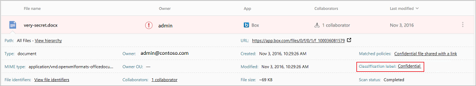
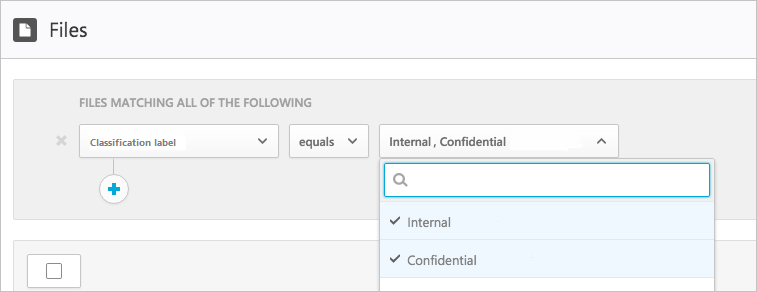

# Интеграция Azure Information Protection

Cloud App Security позволяет исследовать файлы и задавать политики на основе меток классификации в Azure Information Protection. Это дает вам большую осведомленность о конфиденциальных данных в облаке и позволяет более эффективно управлять ими. Процесс интеграции Azure Information Protection с Cloud App Security прост: нужно установить всего один флажок. 

Благодаря интеграции Azure Information Protection с Cloud App Security вы сможете максимально эффективно использовать возможности обеих служб и защищать файлы в облаке; вы также получаете доступ к следующим полезным возможностям:
- возможность централизованно просматривать все классифицированные файлы;
- возможность выполнять исследования согласно уровню классификации и оценивать уровни рисков для конфиденциальных данных в облачных приложениях;
- возможность создавать политики, гарантирующие правильную обработку классифицированных файлов.

> [!NOTE] 
> Для включения этой функции вам потребуется лицензия Cloud App Security и лицензия Azure Information Protection Premium P1 или P2. Если у вас есть обе лицензии, Cloud App Security будет синхронизировать метки организации из службы Azure Information Protection.
> Cloud App Security не поддерживает политики области Azure Information Protection.

## Принцип работы
Возможно, вы знакомы с метками классификации файлов [Azure Information Protection](https://docs.microsoft.com/information-protection/). Теги классификации Azure Information Protection видны в Cloud App Security. После интеграции службы Cloud App Security с Azure Information Protection эта служба сканирует файлы следующим образом:
1. Cloud App Security извлекает список всех меток классификации, используемых в вашем клиенте. Чтобы список оставался актуальным, это следует делать каждый час.
2. Затем Cloud App Security проверяет файлы на наличие меток классификации следующим образом. a. Если включено автоматическое сканирование (см. следующий раздел), все новые или измененные файлы будут добавляться в очередь сканирования.
    b. Если настроена политика обработки файлов (см. следующий раздел) для поиска меток классификации, эти файлы будут добавляться в очередь сканирования меток классификации.
3. Как отмечалось выше, эти проверки обрабатывают метки классификации, обнаруженные в ходе первоначального сканирования, выполняемого Cloud App Security, чтобы найти метки классификации, используемые в клиенте. Внешние метки (метки классификации, заданные внешней стороной, по отношению к клиенту) добавляются в список меток классификации. Если наличие этих меток проверять не требуется, установите флажок **Only scan files for Azure Information Protection classification labels from this tenant** (Сканировать файлы на наличие меток классификации Azure Information Protection только от этого клиента) (см. следующий раздел).
4. После включения Azure Information Protection в Cloud App Security все новые файлы, добавляемые в Office 365, также будут сканироваться на наличие меток классификации.

## Как интегрировать Azure Information Protection с Cloud App Security
  
### Включение Azure Information Protection

Чтобы интегрировать Azure Information Protection с Cloud App Security, нужно включить автоматическое сканирование для поиска меток классификации Azure Information Protection в файлах Office 365, при этом политику создавать не требуется. После включения этой функции файлы, существующие в вашей облачной среде и имеющие метки классификации Azure Information Protection, появятся в Cloud App Security.

Включение Cloud App Security для сканирования файлов с проверкой содержимого на наличие меток классификации

1. В Cloud App Security в меню-шестеренке "Параметры" выберите страницу **Общие параметры**.
2. В Azure Information Protection выберите пункт **Автоматически сканировать файлы на наличие меток классификации Azure Information Protection**. 

После включения Azure Information Protection станут видны файлы с метками классификации, по которым их можно будет фильтровать в Cloud App Security.

 

> [!NOTE] 
> Существующие файлы сканируются автоматически только после их повторного изменения. Чтобы проверить существующие файлы на наличие меток классификации Azure Information Protection, необходима по крайней мере одна **политика изучения содержимого файлов**. Если таковых нет, создайте **политику обработки файлов**, удалите все стандартные фильтры и установите флажок **Content inspection** (Изучение содержимого). В разделе **Content inspection** (Изучение содержимого) щелкните **Include files that match a preset expression** (Включать файлы, соответствующие предварительно заданному значению), выберите такое значение и сохраните политику. Включится анализ содержимого, в рамках которого автоматически обнаруживаются метки классификации Azure Information Protection.

### Задание внутренних и внешних тегов
По умолчанию Cloud App Security сканирует метки классификации, которые определены в вашей организации, а также внешние метки, которые определены другими организациями. 

Чтобы игнорировать метки классификаций других организаций, на портале Cloud App Security в разделе **Общие параметры**, **Azure security settings** (Параметры безопасности Azure) выберите пункт **Ignore Azure Information Protection classification labels from other tenants** (Игнорировать метки классификации Azure Information Protection от других клиентов).
 

### Управление видимостью файлов
- Если это документ, отмеченный меткой классификации Azure Information Protection:

- Вы можете увидеть этот файл в Cloud App Security на странице **Файлы**, отфильтровав содержимое по метке классификации.

- Дополнительные сведения об этих файлах и их метках классификации находятся в контейнере файлов.

- На странице **Файлы** щелкните нужный файл, чтобы посмотреть, есть ли у него метки классификации.

- Щелкните метку классификации, чтобы ознакомиться с дополнительными сведениями или отобразить полный список меток классификации.
 

- Затем можно создать политики обработки файлов в Cloud App Security, которые не должны предоставляться определенным лицам, и файлов, которые были отмечены и недавно изменены.
- Кроме того, вы можете активировать оповещения о действиях, связанных с конфиденциальными файлами.

> [!Note]
> Метки защиты идентификации Azure, отключенные в файле, отображаются как отключенные в Cloud App Security. Удаленные метки не отображаются.

**Политика 1 — конфиденциальные данные на компьютере с доступом извне:**

1.  Создайте политику файла.
2.  Выберите имя, уровень серьезности и категорию политики.
3.  Добавьте следующие фильтры для поиска всех конфиденциальных данных на компьютере с доступом извне:

 

**Политика 2 — защищенные данные SharePoint, которые недавно были изменены, за исключением папки "Финансы":**

1.  Создайте политику файла.
2.  Выберите имя, уровень серьезности и категорию политики.
3.  Добавьте следующие фильтры для поиска всех защищенных данных, которые были недавно изменены, и исключите папку "Финансы" в поле для выбора папки: 
 
 

Также можно настроить уведомления, оповещения пользователя или немедленно принимать какие-либо меры по этим политикам.
Ознакомьтесь с дополнительными сведениями о [действиях управления](governance-actions.md).

Ознакомьтесь с дополнительными сведениями об [Azure Information Protection](https://docs.microsoft.com/en-us/information-protection/understand-explore/what-is-information-protection) и изучите [Руководство по началу работы с Azure Information Protection](https://docs.microsoft.com/en-us/information-protection/get-started/infoprotect-quick-start-tutorial).

## Интеграция с Azure Rights Management

У вашей организации должна быть лицензированная версия Azure Rights Management, активированная для интеграции с Cloud App Security и Azure RMS.  Описание этих двух отдельных действий см. в статье [Активация управления правами Azure](https://docs.microsoft.com/information-protection/deploy-use/activate-service).

Сейчас Cloud App Security поддерживает собственную защиту для файлов Office (2016 и более поздние версии). Защита для файлов PDF и файлов изображений будет доступна в будущих версиях. 

Сейчас эта функция доступна для файлов, которые хранятся в SharePoint Online и OneDrive для бизнеса. В будущих версиях будут поддерживаться и другие облачные приложения.

После подключения Cloud App Security к службе Office 365 вы сможете использовать функции интеграции Cloud App Security RMS, которые позволяют защищать документы с помощью RMS непосредственно на портале Cloud App Security следующим образом:

1. На странице **Файлы** выберите файл, который требуется защитить, а затем щелкните многоточие в конце строки файла и выберите **Защита**. 

>[!NOTE]
>Azure Information Protection защищает файлы размером не больше 50 МБ. 

2. Вам будет предложено выбрать одну из корпоративных меток классификации для защиты файла. Затем щелкните **Защитить**. 

3. Когда вы выберете метку классификации и щелкнете "Защита", Cloud App Security применит эту метку и обеспечит защиту исходного файла. T
> [!NOTE]
>   Рекомендуется применять для файлов метки классификации RMS корпоративного уровня, чтобы все пользователи в организации могли получать доступ к ним, в том числе и владелец исходного файла. Владелец файла, политика совместного использования файла и список пользователей, уже имеющих доступ к нему, не меняются, когда файл становится защищенным.

4. Если пользователям требуется доступ к защищенному файлу, на их устройстве обязательно должно быть установлено приложение для управления доступом RMS. Дополнительные сведения см. в статье [Технический обзор и сведения о защите для приложения для управления доступом Microsoft Rights Management](https://docs.microsoft.com/information-protection/rms-client/sharing-app-admin-guide-technical).

5. Это действие можно в любое время отменить в **журнале управления**, нажав кнопку **Вернуть** в конце строки действия защиты, выполненного ранее. 

Дополнительные сведения о работе Cloud App Security с Azure Information Protection см. в статье [Защита данных от ошибок пользователей](https://docs.microsoft.com/enterprise-mobility-security/solutions/protect-data-user-mistake).

 
## Видео по теме  
[MCAS + AIP Integrations](https://channel9.msdn.com/Shows/Microsoft-Security/MCAS--AIP-Integrations) (Интеграция Microsoft Cloud App Security и Azure Information Protection)  

## См. также  
[Управление облачными приложениями с помощью политик](control-cloud-apps-with-policies.md)   
[Получить техническую поддержку можно на странице службы технической поддержки Cloud App Security.](http://support.microsoft.com/oas/default.aspx?prid=16031)   
[Клиенты с поддержкой Premier также могут выбрать Cloud App Security непосредственно на портале Premier.](https://premier.microsoft.com/)  
  
