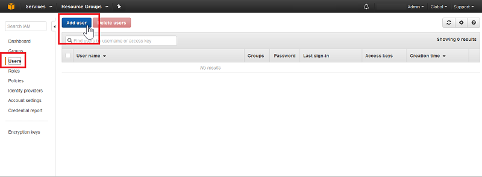
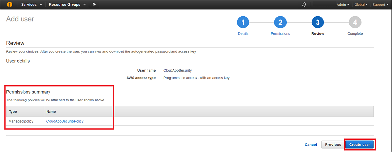
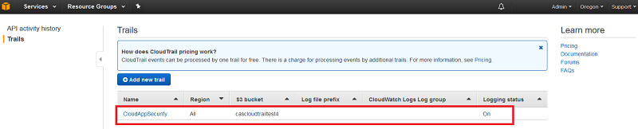

# <a name="connect-aws-to-microsoft-cloud-app-security"></a>Подключение AWS к Microsoft Cloud App Security
Этот раздел содержит инструкции по подключению Cloud App Security к существующей учетной записи Amazon Web Services с помощью интерфейсов API соединителя.  
  
## <a name="how-to-connect-amazon-web-services-to-cloud-app-security"></a>Порядок подключения Amazon Web Services к Cloud App Security  
  
1.  В [консоли Amazon Web Services](https://console.aws.amazon.com/) в разделе **Безопасность, идентификация и соответствие** щелкните **IAM**.  
  
       
  
2.  Откройте вкладку **Пользователи** и нажмите кнопку **Добавить пользователя**.  
  
           
  
4.  На шаге **Сведения** укажите новое имя пользователя для Cloud App Security, в поле **Тип доступа** выберите **Программный доступ** и нажмите кнопку **Next Permissions** (Далее — разрешения).  

     

5. На шаге **Разрешения** щелкните **Attach existing policies directly** (Присоединить существующие политики напрямую), а затем нажмите кнопку **Create policy** (Создать политику).

   

6.  В разделе **Create Policy** (Создание политики) выберите **Create Your Own Policy** (Создать собственную политику).
 
    
 
7.  В разделе **Review Policy** (Просмотр политики) в поле **Policy Name** (Имя политики) введите имя, например CloudAppSecurityPolicy.

    

8. Вставьте следующий фрагмент в поле **Policy Document** (Документ политики), а затем нажмите кнопку **Create policy** (Создать политику):
  
    ```     
    {  
      "Version" : "2012-10-17",  
      "Statement" : [{  
          "Action" : [  
            "cloudtrail:DescribeTrails",  
            "cloudtrail:LookupEvents",  
            "cloudtrail:GetTrailStatus",  
            "cloudwatch:Describe*",  
            "cloudwatch:Get*",  
            "cloudwatch:List*",  
            "iam:List*",  
            "iam:Get*"  
          ],  
          "Effect" : "Allow",  
          "Resource" : "*"  
        }  
      ]  
     }  
  
    ```  
  
9. Вернитесь на страницу **Добавление пользователя**, при необходимости обновите список, выберите только что созданного пользователя и нажмите кнопку **Далее — просмотр**.

   

10. Если все сведения указаны правильно, нажмите кнопку **Создать пользователя**.

    

11. При получении сообщения об успехе щелкните **Скачать CSV-файл**, чтобы сохранить копию новых учетных данных пользователя, которые потребуются позднее.  

    
  
10. В консоли AWS щелкните **Службы** и затем в разделе **Средства управления** щелкните **CloudTrail**.  
  
       
  
    Если ранее вы не использовали CloudTrail, нажмите кнопку **Приступая к работе** и настройте этот компонент, указав имя и выбрав соответствующий сегмент S3. Затем щелкните **Turn On** (Включить). Чтобы обеспечить полное покрытие, задайте для параметра **Apply to all regions** (Применить ко всем регионам) значение **Да**.
  
       
  
    Вы увидите новое имя в CloudTrail в списке **Trails** (Журналы).
    
      
  
11. На портале Cloud App Security выберите пункты **Исследовать** и **Подключенные приложения**.  
  
12. На странице **App connectors** (Соединители с приложениями) щелкните знак "плюс", а затем — **AWS**.  
  
       
  
13. Во всплывающем окне вставьте значения параметров **Ключ доступа** и **Секретный ключ** из CSV-файла в соответствующие поля и нажмите кнопку **Подключить**.  
    
  
14. Убедитесь, что подключение установлено, щелкнув элемент **Тестирование API**.  
  
     Проверка может занять несколько минут. После завершения выдается уведомление об успехе или неудаче. После получения уведомления об успешном выполнении нажмите кнопку **Готово**.  
  
После подключения AWS вы получите события за 7 дней, предшествовавших подключению, если вы пока не включили CloudTrail. В противном случае вы будете получать события с момента включения CloudTrail.
  
## <a name="see-also"></a>См. также  
[Управление облачными приложениями с помощью политик](control-cloud-apps-with-policies.md)   
[Для получения технической поддержки посетите страницу службы технической поддержки Cloud App Security.](http://support.microsoft.com/oas/default.aspx?prid=16031)   
[Клиенты с поддержкой Premier также могут выбрать Cloud App Security непосредственно на портале Premier.](https://premier.microsoft.com/)  
  
  