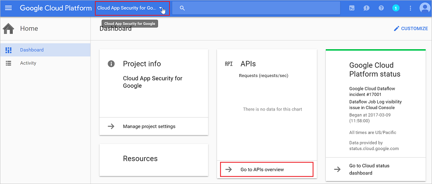
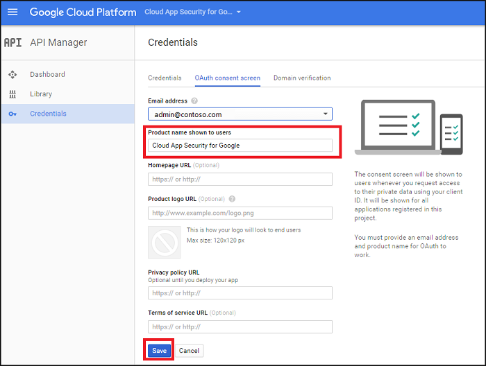
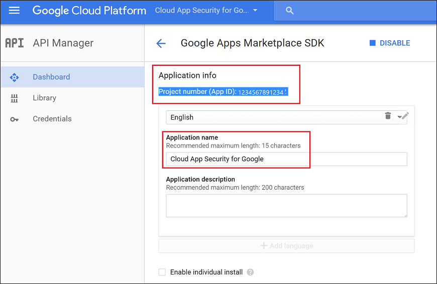
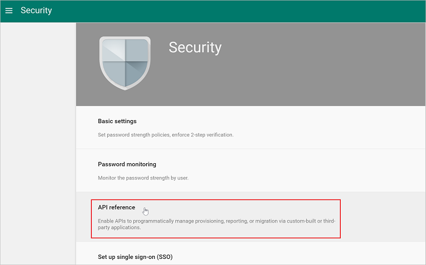
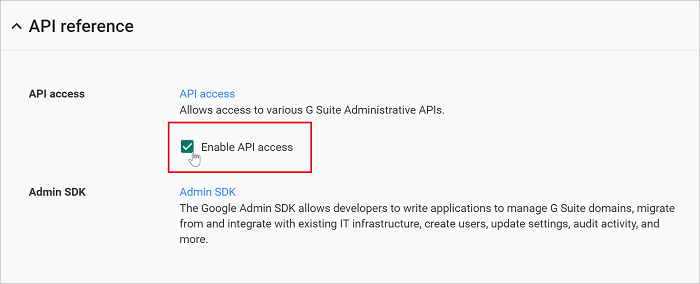

# Подключение G Suite к Microsoft Cloud App Security
Этот раздел содержит инструкции по подключению Cloud App Security к существующей учетной записи G Suite с помощью интерфейсов API соединителя.

  
  
## Настройка G Suite  
  
1.  Являясь суперадминистратором G Suite, войдите на сайт [https://cloud.google.com/console/project](https://cloud.google.com/console/project).  
  
2.  Щелкните **Create project** (Создать проект) для запуска нового проекта.  
  
       
  
3.  На экране **Новый проект** назовите проект следующим образом: 
    **Cloud App Security for Google** и нажмите кнопку **Create** (Создать).  
             
  
4.  После создания проекта на панели инструментов, рядом с элементом Google Cloud Platform, выберите проект и затем в разделе **API** щелкните **Go to APIs overview** (Перейти к обзору API-интерфейсов).  
  
       
  
5.  В разделе **API** отключите все перечисленные API-интерфейсы.  
      
6.  Щелкните **Library** (Библиотека) и включите следующие API (если API не отображается в списке **Popular APIs** (Популярные API), воспользуйтесь строкой поиска):  
  
       
  
    > [!NOTE]  
    >  Проигнорируйте предупреждение об **учетных данных**.  
  
    -   Admin SDK (SDK администрирования)  
  
    -   Audit API (API аудита)  
  
    -   API Google Drive  
  
    -   Google Apps Marketplace SDK  
  
    -   Gmail API  
            
7.  В списке **Enabled APIs** (Включенные API) должно быть пять элементов:  
  
       
  
8.  Щелкните **Credentials** (Учетные данные) и затем — **OAuth consent** (Получение согласия OAuth).  
  
    -   В поле **Product name shown to users** (Имя продукта, отображаемое пользователям) введите **Cloud App Security for Google**.  
  
    -   Заполнять остальные поля необязательно.  
  
    -   Нажмите кнопку **Сохранить**.  
  
       
  
9. На экране **API Credentials** (Учетные данные API) щелкните стрелку рядом с полем **Create credentials** (Создать учетные данные).  
  
       

10. Выберите пункт **Service account key** (Ключ учетной записи службы).

       
  
11. В разделе **Create service account key** (Создание ключа учетной записи службы) выберите **New service account** (Новая учетная запись службы) и введите любое имя, например **Service account 1**. В разделе **Role** (Роль) выберите **Project** (Проект), а затем — **Editor** (Редактор), после этого в разделе **Key type** (Тип ключа) выберите **P12** и нажмите кнопку **Create** (Создать).  
  
       
  
12.  Файл сертификата P12 будут сохранен на компьютере. Во всплывающем окне будет указан **пароль для закрытого ключа**. Сохраните его для последующего использования.  
        
12. В правой части экрана **Credentials** (Учетные данные) щелкните **Manage service accounts** (Управление учетными записями служб).  
         
  
13. Щелкните три точки справа от созданной учетной записи службы и выберите **Изменить**.  
  
       
  
14. Установите флажок **Enable G Suite Domain-wide Delegation** (Включить делегирование в рамках домена G Suite) и нажмите кнопку **Save** (Сохранить).  
  
       
  
15. Скопируйте присвоенное службе значение **Service account ID** (Идентификатор учетной записи службы) — оно понадобится позже.  
  
       
  
16. Откройте меню Google, щелкнув три горизонтальные линии рядом с Google Cloud Platform, и выберите **API manager** (Диспетчер API), за которым следует **Dashboard** (Панель мониторинга).  
    
17. Прокрутите список включенных API-интерфейсов и щелкните значок шестеренки рядом с **API Google Drive**.   
         

18. Заполните следующие поля:

    -   **Application Name** (Имя приложения): Cloud App Security for Google.  
  
    -   **Short Description & Long Description** (Короткое и длинное описание) (необязательно): Microsoft Cloud App Security обеспечивает видимость облачных приложений, помогая контролировать, анализировать и регулировать использование облачных приложений, защищать корпоративные данные, а также обнаруживать подозрительные действия для любого облачного приложения.  
  
    -   Google требует отправить по крайней мере один значок приложения. Перейдите по адресу [https://portal.cloudappsecurity.com/cas/static/files/MSLogos.zip](https://portal.cloudappsecurity.com/cas/static/files/MSLogos.zip) и скачайте ZIP-файл, содержащий значки Cloud App Security. Затем в разделе **Application icon** (Значок приложения) перетащите изображения размером 128x128 и 32x32.  
  
    -   В разделе **Drive Integration** (Интеграция диска) введите следующие данные в поле **Открыть URL-адрес:**  
  
         https://portal.cloudappsecurity.com/#/services/11770?tab=files  
  
    -   Щелкните **Save Changes** (Сохранить изменения).  
  
           
  
19. В списке **Enabled APIs** (Включенные API) щелкните значок параметров с шестеренкой рядом с **Google Apps Marketplace SDK**. 
           
20. Откройте вкладку **Configuration** (Конфигурация).  
  
    -   Скопируйте отображаемое сверху значение **Project number (App ID)** (Номер проекта — идентификатор приложения) для использования в дальнейшем.  
  
    -   В поле **Application Name** (Имя приложения) должно быть указано **Cloud App Security for Google**.
  
         Укажите в поле **Application description** (Описание приложения) следующее: "Microsoft Cloud App Security обеспечивает видимость облачных приложений, помогая контролировать, анализировать и регулировать использование облачных приложений, защищать корпоративные данные, а также обнаруживать подозрительные действия для любого облачного приложения".  
  
    -   Снимите флажок **Enable individual install** (Включить отдельную установку).  
  
    -   Настройте четыре требуемых изображения в разделе **Application icons** (Значки приложения).  
  
         Эти изображения можно найти по адресу: [https://portal.cloudappsecurity.com/cas/static/files/MSLogos.zip](https://portal.cloudappsecurity.com/cas/static/files/MSLogos.zip)  
  
           
  
    -   Задайте приведенные ниже значения **Support URLs** (URL-адреса поддержки):  
  
        -   **URL-адрес условий использования**: http://go.microsoft.com/fwlink/?LinkID=733268  
  
        -   **URL-адрес политики конфиденциальности**: http://go.microsoft.com/fwlink/?LinkId=512132  
  
    -   В разделе **OAuth 2.0 scopes** (Области OAuth 2.0) скопируйте и вставьте следующие адреса. Их нужно копировать по одному, нажимая после каждого клавишу ВВОД.  
  
           https://www.googleapis.com/auth/admin.reports.audit.readonly  
  
           https://www.googleapis.com/auth/admin.reports.usage.readonly  
  
           https://www.googleapis.com/auth/drive  
  
           https://www.googleapis.com/auth/drive.appdata  
  
           https://www.googleapis.com/auth/drive.apps.readonly  
  
           https://www.googleapis.com/auth/drive.file  
  
           https://www.googleapis.com/auth/drive.metadata.readonly  
  
           https://www.googleapis.com/auth/drive.readonly  
  
           https://www.googleapis.com/auth/drive.scripts  
  
           https://www.googleapis.com/auth/admin.directory.user.readonly  
  
           https://www.googleapis.com/auth/admin.directory.user.security  
  
           https://www.googleapis.com/auth/admin.directory.user.alias  
  
           https://www.googleapis.com/auth/admin.directory.orgunit  
  
           https://www.googleapis.com/auth/admin.directory.notifications  
  
           https://www.googleapis.com/auth/admin.directory.group.member  
  
           https://www.googleapis.com/auth/admin.directory.group  
  
           https://www.googleapis.com/auth/admin.directory.device.mobile.action  
  
           https://www.googleapis.com/auth/admin.directory.device.mobile  
  
           https://www.googleapis.com/auth/admin.directory.user  
  
    -   Щелкните **Сохранить изменения**.  
  
18. Перейдите на страницу [admin.google.com](https://admin.google.com/) и выберите **Security** (Безопасность). 
         
 
19. Выберите **API reference** (Справочник по API).  
         
      
20. Выберите **Enable API Access** (Включить доступ к API) и нажмите кнопку **Save changes** (Сохранить изменения).  
  
      

  
## Настройка Cloud App Security  
  
1.  На портале Cloud App Security выберите пункты **Исследовать** и **Подключенные приложения**.  
  
2.  На странице **Connected apps** (Подключенные приложения) щелкните знак "плюс" и выберите **G Suite**.  
       
  
3.  Во всплывающем окне введите следующее:  
  
       
  
    1.  **Service Account email address** (Адрес электронной почты учетной записи службы), скопированный на шаге 16.  
  
    2.  **Project number (App ID)** (Номер проекта — идентификатор приложения), скопированный в шаге 21.  
  
    3.  Отправьте **Certificate** (Сертификат) P12, сохраненный на шаге 12. Для этого потребуется сохраненный ранее пароль.  
  
    4.  Введите один **адрес электронной почты учетной записи администратора** вашего администратора G Suite.  
  
    5.  При наличии учетной записи G Suite Unlimited установите этот флажок. Сведения о том, какие функции доступны в Cloud App Security для G Suite Unlimited, см. в статье [Включение мгновенной видимости, защиты и действий управления для приложений](enable-instant-visibility-protection-and-governance-actions-for-your-apps.md).  
  
    6.  Щелкните **Сохранить настройки**.  
  
    7.  **Перейдите по ссылке** для подключения к G Suite. При этом открывается G Suite и предлагается авторизовать доступ для Cloud App Security.  
         
    8.  Убедитесь, что подключение установлено, щелкнув **Test now** (Проверить).  
  
         Проверка может занять несколько минут.  
  
         После получения уведомления об успешном выполнении нажмите кнопку **Готово** и закройте страницу G Suite.  
  
  
После подключения G Suite вы получите события за 60 дней, предшествовавших подключению.
  
После подключения G Suite служба Cloud App Security выполняет полное сканирование. В зависимости от количества файлов и пользователей полное сканирование может занять некоторое время. Чтобы обеспечить сканирование почти в реальном времени, файлы, действия с которыми обнаружены, перемещаются в начало очереди сканирования. Например, файл, который изменяется, обновляется или предоставляется, сканируется немедленно, так что вам не приходится ждать, когда он будет обработан стандартным процессом сканирования. Это не относится к файлам, содержимое которых не изменяется, например к файлам, которые просматриваются, печатаются или экспортируются.
  
  
## См. также  
[Управление облачными приложениями с помощью политик](control-cloud-apps-with-policies.md)   
[Для получения технической поддержки посетите страницу службы технической поддержки Cloud App Security.](http://support.microsoft.com/oas/default.aspx?prid=16031)   
[Клиенты с поддержкой Premier также могут выбрать Cloud App Security непосредственно на портале Premier.](https://premier.microsoft.com/)  
  
  