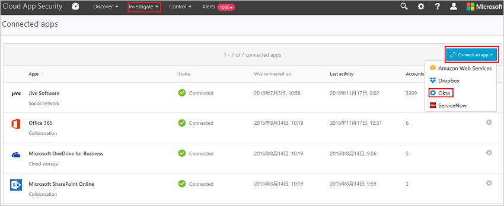

# Подключение Okta к Microsoft Cloud App Security
Этот раздел содержит инструкции по подключению Cloud App Security к существующей учетной записи Okta с помощью интерфейсов API соединителя.  
  
## Порядок подключения Okta к Cloud App Security  
  
1.  Рекомендуется создать в Okta учетную запись службы с правами администратора для Cloud App Security.  
  
     Используйте учетную запись с разрешениями суперадминистратора.  
  
     Проверьте учетную запись Okta.  
  
2.  В консоли Okta щелкните элемент **Администрирование**.  
  
    -   Щелкните **Безопасность** и затем **API**.  
  
           
  
    -   Щелкните **Создание токена**.  
  
           
  
    -   Во всплывающем окне **Create Token** (Создание токена) укажите имя токена Cloud App Security и щелкните **Create Token** (Создать токен).  
  
           
  
    -   Во всплывающем окне с сообщением о том, что **токен успешно создан**, скопируйте **значение токена**.  
  
           
  
3.  В консоли Cloud App Security щелкните **Исследовать**, а затем — **Подключенные приложения**.  
  
4.  На странице **Соединители приложений** нажмите кнопку **Подключить приложение**, а затем — **Okta**.  
  
       
  
5.  Во всплывающем окне в поле **Домен** укажите домен Okta и вставьте токен в поле **Токен**.  
  
6.  Щелкните **Подключить**, чтобы создать токен для Okta в Cloud App Security.  
  
7.  Убедитесь, что подключение установлено, щелкнув элемент **Тестирование API**.  
  
     Проверка может занять несколько минут. После получения уведомления об успешном выполнении нажмите кнопку **Закрыть**.  
  
После подключения Okta вы получите события за 60 дней, предшествовавших подключению.
  
## См. также  
[Управление облачными приложениями с помощью политик](control-cloud-apps-with-policies.md)   
[Для получения технической поддержки посетите страницу службы технической поддержки Cloud App Security.](http://support.microsoft.com/oas/default.aspx?prid=16031)   
[Клиенты с поддержкой Premier также могут выбрать Cloud App Security непосредственно на портале Premier](https://premier.microsoft.com/).  
  
  

<!--HONumber=Nov16_HO4-->

