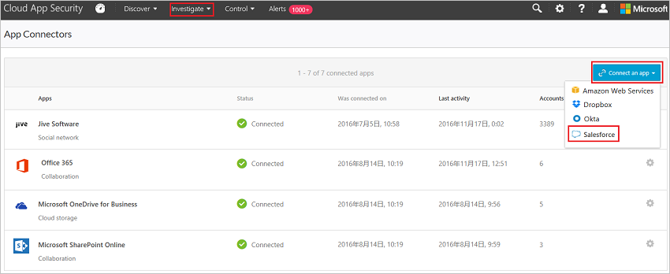

# Подключение Salesforce к Microsoft Cloud App Security
Этот раздел содержит инструкции по подключению Cloud App Security к существующей учетной записи Salesforce с помощью API соединителя приложений.  
  
## Порядок подключения Salesforce к Cloud App Security  
  
1.  Рекомендуется использовать выделенную учетную запись администратора службы для Cloud App Security.  
  
2.  Убедитесь, что в Salesforce включен REST API.  
  
     Ваша учетная запись Salesforce должна относиться к одному из следующих выпусков, поддерживающих REST API:  
  
     **Performance**, **Enterprise**, **Unlimited** или **Developer**.  
  
     Выпуск **Professional** не имеет REST API по умолчанию, но его можно добавить по запросу.  
  
     Убедитесь, что REST API доступен и включен во всех используемых выпусках:  
  
    -   Войдите в учетную запись Salesforce и перейдите на страницу **Установка**.  
  
    -   В разделе **Управление пользователями** перейдите на страницу **Профили**.  
  
           
  
    -   Выберите профиль, используемый для развертывания Cloud App Security, и нажмите кнопку **Изменить**. Это профиль для использования учетной записи службы Cloud App Security при настройке соединителя приложения.  
  
           
  
    -   Убедитесь, что флажок **API Enabled** (API включен) установлен. Если это не так, вам может потребоваться обратиться в Salesforce, чтобы добавить его в учетную запись.  
  
           
  
3.  Если в вашей организации включен параметр **Salesforce CRM Content** (Содержимое Salesforce CRM), убедитесь, что он включен и в используемой учетной записи администратора.  
  
    1.  Перейдите на страницу установки Salesforce.  
  
           
  
    2.  В боковом меню выберите пункт **Управление пользователями** и нажмите кнопку **Пользователи**.  
  
           
  
    3.  Выберите вашего выделенного пользователя Cloud App Security в качестве текущего пользователя с правами администратора.  
  
    4.  Убедитесь, что установлен флажок **Salesforce CRM Content User** (Пользователь содержимого Salesforce CRM).  
  
         Если он не установлен, щелкните **Изменить** и установите его.  
  
           
  
    5.  Нажмите кнопку **Сохранить**.  
  
4.  В консоли Cloud App Security щелкните **Исследовать**, а затем — **Подключенные приложения**.  
  
5.  На странице **Соединители приложений** нажмите кнопку **Подключить приложение**, а затем — **Salesforce**.  
  
       
  
6.  На вкладке "API" страницы параметров Salesforce щелкните **Перейти по ссылке** с учетом того, какой экземпляр требуется установить.  
  
7.  Открывается страница входа в Salesforce. Введите свои учетные данные, чтобы разрешить Cloud App Security доступ к приложению Salesforce вашей группы.  
  
       
  
8.  Salesforce запрашивает, следует ли Cloud App Security разрешить доступ к журналу действий и сведениям группы, а также выполнение любых действий от лица любого члена группы. Для продолжения нажмите кнопку **Разрешить**.  
  
9. На этом этапе выдается уведомление об успехе или неудаче развертывания. Служба Cloud App Security теперь авторизована на сайте Salesforce.com.  
  
10. После возвращения в консоль Cloud App Security должно появиться сообщение об успешном подключении Salesforce.  
  
11. Убедитесь, что подключение установлено, щелкнув элемент **Тестирование API**.  
  
     Проверка может занять несколько минут. После получения уведомления об успешном выполнении нажмите кнопку **Готово**.  
  
  
После подключения SalesForce вы будете получать события следующим образом: триггеры —с момента подключения; события входа и журнал аудита настройки — за 60 дней, предшествовавших подключению; EventMonitoring — за 30 или 1 предшествующий день в зависимости от лицензии SalesForce EventMonitoring.
  
## См. также  
[Управление облачными приложениями с помощью политик](control-cloud-apps-with-policies.md)   
[Для получения технической поддержки посетите страницу службы технической поддержки Cloud App Security.](http://support.microsoft.com/oas/default.aspx?prid=16031)   
[Клиенты с поддержкой Premier также могут выбрать Cloud App Security непосредственно на портале Premier](https://premier.microsoft.com/).  
  
  

<!--HONumber=Nov16_HO4-->

