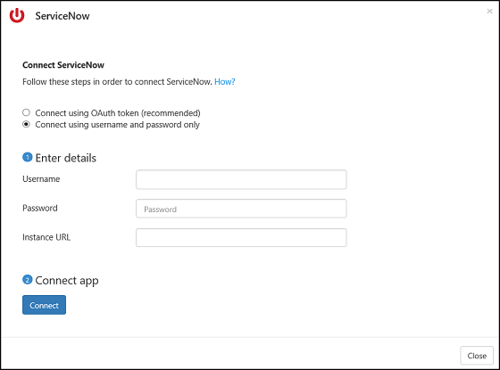

# Подключение ServiceNow к Microsoft Cloud App Security

Этот раздел содержит инструкции по подключению Cloud App Security к существующей учетной записи ServiceNow с помощью API соединителя приложений. 

 >  [!NOTE]
>  Рекомендуем развернуть ServiceNow с помощью токенов приложения OAuth, которые доступны для Fuji и последующих выпусков (дополнительные сведения см. в соответствующей [документации по ServiceNow](http://wiki.servicenow.com/index.php?title=OAuth_Applications#gsc.tab=0)). Для более ранних выпусков доступен [устаревший режим подключения](#legacy-servicenow-connection) с использованием имени пользователя и пароля.

 > [!NOTE]  
>  Cloud App Security поддерживает версии ServiceNow Eureka, Fiji, Geneva, Helsinki и Istanbul. Для подключения к ServiceNow с помощью Cloud App Security требуется роль **администратора**, а экземпляр ServiceNow должен поддерживать доступ к API.  Дополнительные сведений см. в [документации по ServiceNow](http://wiki.servicenow.com/index.php?title=Base_System_Roles#gsc.tab=0).
  
## Как подключить ServiceNow к Cloud App Security с помощью OAuth
  
  
1.  Войти в учетную запись ServiceNow с помощью с учетной записи администратора.  
  
2.  В строке поиска **Filter navigator** (Навигатор фильтра) введите **OAuth** и выберите **Application Registry** (Реестр приложения).

3. В строке меню **Application Registries** (Реестры приложения) выберите пункт **New** (Создать), чтобы создать профиль OAuth.

   

4. В разделе **What kind of OAuth application?** (Тип приложения OAuth) щелкните **Create an OAuth API endpoint for external clients** (Создать конечную точку API OAuth для внешних клиентов).

   

5. В разделе **Application Registries New record** (Новая запись в реестрах приложения) укажите следующие данные:
    
    - В поле **Name** (Имя) введите имя нового профиля OAuth, например CloudAppSecurity. 
    
    - Значение в поле **Client ID** (Идентификатор клиента) будет создано автоматически. Скопируйте этот идентификатор — его потребуется вставить в Cloud App Security для завершения подключения.
    
    - В поле **Client Secret** (Секрет клиента) введите строку. Если оставить это поле пустым, автоматически будет создан произвольный секрет. Скопируйте и сохраните его для последующего использования. 
    
    - Увеличьте значение в поле **Access Token Lifespan** (Время существования токена доступа) по крайней мере до 3600.
    
    - Нажмите кнопку **Отправить**.

   

6.  На портале Cloud App Security выберите пункты **Исследовать** и **Подключенные приложения**.  
  
7.  На странице **App connectors** (Соединители с приложениями) щелкните знак "плюс", а затем — **ServiceNow**.  
  
       
  
8.  Во всплывающем окне добавьте идентификатор пользователя, пароль, URL-адрес экземпляра ServiceNow, а также идентификатор клиента и секрет клиента.  
  
9.  Нажмите кнопку **Подключить**.  
  
       
  
10.  Убедитесь, что подключение установлено, щелкнув **Test now** (Проверить).  
  
     Проверка может занять несколько минут. После получения уведомления об успешном выполнении нажмите кнопку **Закрыть**.  
  
После подключения ServiceNow вы получите события за 60 дней, предшествовавших подключению.
  
## Подключение к ServiceNow в устаревшем режиме

Для подключения к ServiceNow с помощью Cloud App Security требуются разрешения уровня администратора, а экземпляр ServiceNow должен поддерживать доступ к API.   

1.  Войти в учетную запись ServiceNow с помощью с учетной записи администратора.   

2.  Создайте учетную запись службы для Cloud App Security и подключите к ней роль администратора.   

3.  Убедитесь в том, что подключаемый модуль REST API включен.   

       

4.  На портале Cloud App Security щелкните **Сведения** и затем **Санкционированные приложения**.   

5.  Перейдя в строку ServiceNow, щелкните элемент **Подключение** в столбце **Состояние соединителя приложений** или нажмите кнопку **Подключить приложение**, а затем щелкните элемент **ServiceNow**.   

       

6.  На вкладке "API" страницы параметров ServiceNow добавьте идентификатор пользователя, пароль и URL-адрес экземпляра ServiceNow в соответствующих полях.   

7.  Нажмите кнопку **Подключить**.   

      

8.  Убедитесь, что подключение установлено, щелкнув элемент **Тестирование API**.   
  
   Проверка может занять несколько минут. После получения уведомления об успешном выполнении нажмите кнопку **Закрыть**.   
 После подключения ServiceNow вы получите события за 60 дней, предшествовавших подключению. 

## См. также  
[Управление облачными приложениями с помощью политик](control-cloud-apps-with-policies.md)   
[Для получения технической поддержки посетите страницу службы технической поддержки Cloud App Security.](http://support.microsoft.com/oas/default.aspx?prid=16031)   
[Клиенты с поддержкой Premier также могут выбрать Cloud App Security непосредственно на портале Premier.](https://premier.microsoft.com/)  
  
