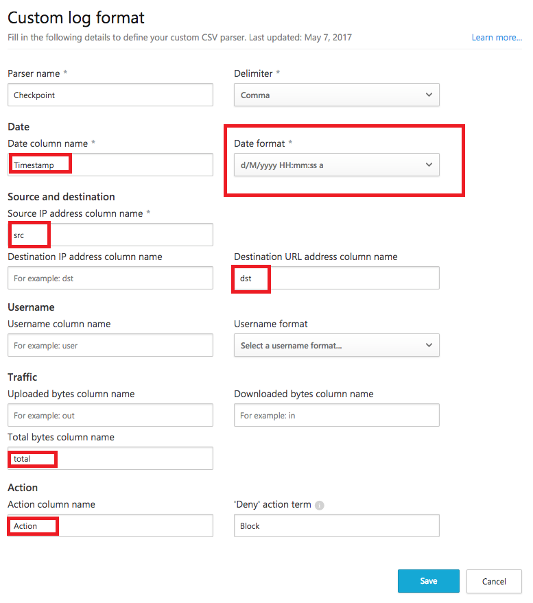

# Использование настраиваемого средства синтаксического анализа журналов
Компонент Cloud App Security позволяет настраивать пользовательское средство синтаксического анализа для сопоставления и обработки формата журналов, чтобы их можно было использовать для Cloud Discovery, даже если журналы принадлежат брандмауэру или устройству, которые компонент Cloud App Security явно не поддерживает. 

Чтобы пользовательское средство синтаксического анализа позволило использовать журналы из неподдерживаемых брандмауэров, выполните следующую процедуру. 

 
Настройка пользовательского средства синтаксического анализа CSV.
1.  На портале Cloud App Security щелкните **Обнаружение**, а затем — **Создать отчет о снимке**.  
  
    
     
3.  Введите **имя отчета** и **описание**.
  
4.  В разделе **Источник данных** выберите **Пользовательский формат журнала...**.  

        

5. Соберите журналы из брандмауэра и прокси-сервера, через которые пользователи в вашей организации получают доступ к Интернету. Сбор производите по время пиковой нагрузки, чтобы в данных были отражены все действия пользователей в организации. 

6. Откройте журналы, которые требуется обработать в текстовом редакторе, и проверьте их формат: имена столбцов в журнале должны соответствовать полям на экране **Пользовательский формат журнала**.

   

7. Заполните поля на основе данных, чтобы указать, какие столбцы данных соответствуют конкретным полям в Cloud App Security. Может потребоваться изменить имена столбцов в файле журнала, чтобы они правильно сопоставлялись.
  
   > [!NOTE]
    > Данные в полях должны вводиться с учетом регистра. Убедитесь, что имена столбцов в Cloud App Security и файле журнала идентичны. Также убедитесь, что в них выбран одинаковый формат даты.

    

7. Нажмите кнопку **Сохранить**. Формат пользовательского журнала, который вы настроили, будет сохранен как пользовательское средство синтаксического анализа по умолчанию. Его можно изменить в любое время, нажав кнопку "Редактировать".

5. В разделе **Выберите журналы трафика** выберите измененный файл журнала и отправьте его. Одновременно можно отправить до 20 файлов. Также поддерживаются сжатые и ZIP-файлы.  
  

6.  Нажмите кнопку **Create** (Создать).  

7.  После завершения отправки в правом верхнем углу отображается сообщение о состоянии, указывающее, что журнал был успешно отправлен.  
  
8.  После отправки файлов журнала их анализ может занять некоторое время.  
После завершения обработки файлов журналов вы получите по электронной почте уведомление об этом. 
  
9. В верхней части портала в строке состояния появится баннер со сведениями о ходе обработки файлов журнала.  
 
   
10. После отправки журналов появится уведомление о том, что обработка файлов журнала успешно завершена. На этом этапе можно просмотреть отчет, щелкнув ссылку в строке состояния либо значок параметров в виде шестеренки и выбрав пункт **Параметры Cloud Discovery**.   
  
     
11. Затем щелкните пункт **Управление отчетами о снимках** и выберите отчет о снимке.
 
    

  
      

## См. также:
 
[Создание отчетов о снимках Cloud Discovery](create-snapshot-cloud-discovery-reports.md)

[Настройка автоматической отправки журналов для непрерывных отчетов](configure-automatic-log-upload-for-continuous-reports.md)

[Работа с данными Cloud Discovery](working-with-cloud-discovery-data.md)

