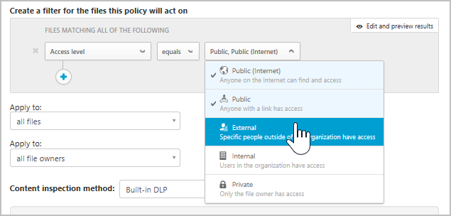

# Управление файлами и их защита  

Современным корпорациям с множеством данных и огромным количеством устройств довольно сложно отслеживать, где находятся их данные и кто получает к ним доступ. Компонент Cloud App Security позволяет контролировать данные за счет включения защиты файлов в облаке. В Cloud App Security доступны средства для создания политик, которые определяют разрешенные и запрещенные действия в корпоративном облаке. Также Cloud App Security предоставляет широкий спектр автоматизированных процессов, предназначенных для постоянной проверки на соответствие, выполнения юридических задач eDiscovery, реализации политики защиты от потери конфиденциальных данных, хранящихся в облаке, к которым предоставлен внешний или общий доступ, а также других примеров использования.  
Cloud App Security может отслеживать файлы любых типов с помощью более чем 20 фильтров метаданных (например, уровень доступа, тип файла). Дополнительные сведения см. в статье [Файлы](file-filters.md). Ниже приведены два примера угроз, связанных с данными, с которыми сталкиваются все организации. Примеры содержат процедуры защиты файлов в облаке.
 
## К файлам, содержащим конфиденциальные данные, предоставлен внешний доступ 

Этот пример применим к Office 365, G Suite, Box, Dropbox и Salesforce.

### УГРОЗА
Одно из лучших преимуществ, которое предоставляет облачная технология, — возможность поделиться чем угодно. Но чем больше сила, тем больше ответственность. Чтобы убедиться, что к конфиденциальным данным не предоставляется внешний доступ, нужно знать, какие файлы содержат конфиденциальные данные и кому предоставляется доступ. С помощью предоставленных в облачных приложениях средств вы не сможете узнать, что сохранено в облачном приложении и у кого есть доступ. Вы не узнаете о возможных утечках данных.

### РЕШЕНИЕ
Чтобы выявить возможные бреши, найдите эти два параметра (конфиденциальность и уровень доступа) и объедините их. Cloud App Security сканирует все файлы, сохраненные в облачных приложениях, и автоматически классифицирует их по уровням доступа. После вы можете настроить в политике файлов Cloud App Security поиск всех конфиденциальных данных в облачных приложениях. После того как вы найдете конфиденциальный файл, к которому предоставляется доступ за пределами организации, вы можете вручную устранить риски или задать автоматические действия в Cloud App Security. Так вы сможете устранить риск утечки данных одним щелчком.

#### Предварительные условия

[Подключите](enable-instant-visibility-protection-and-governance-actions-for-your-apps.md) хотя бы одно облачное приложение к Cloud App Security.

#### Настройка мониторинга

1.    Запустите мониторинг приложения, настроив политику, которая будет проверять все публикуемые за пределами организации файлы на наличие конфиденциальных данных.

    1. На странице **Политики** щелкните [**Создать политику файлов**](data-protection-policies.md). 
    

    2. В поле [**Шаблон политики**](policy-template-reference.md) выберите **В облаке обнаружен файл, содержащий PII-данные (встроенный механизм защиты от потери данных)** и нажмите кнопку **Применить шаблон**. 
    
    3. Чтобы отслеживать нежелательное предоставление доступа к файлам, содержащим конфиденциальные сведения, добавьте фильтр с уровнем доступа, который вы хотите запретить, например **уровень доступа — внешний, общедоступный, общедоступный (Интернет)**. 
     

2. Анализ совпадений
    
    1. На странице **Политики** щелкните имя политики, чтобы перейти к **отчету политики** и просмотреть совпадения, инициируемые для политики.

    2. Для анализа совпадения щелкните его, чтобы открыть контейнер файлов. В контейнере вы увидите другие политики, с которыми совпадает этот файл, и состояние проверки содержимого. Если выбрать состояние, можно увидеть совпадения содержимого. Щелкните элемент **Участники совместной работы**, чтобы просмотреть список участников и узнать, присвоены ли файлу метки классификации. Вы также можете просмотреть **путь**, чтобы узнать, где сохранен файл, и получить больше сведений о самом файле.
    
    3. Если вы нашли ложные срабатывания, отметьте их флажком, чтобы исключить их из отчета и динамических совпадений. С помощью средства обратной связи вы можете сообщить команде Cloud App Security об улучшениях, которые вы хотите добавить. 

#### Проверка политики

1. Создайте новый документ Word со следующим содержимым: 078-05-1120.
2. Сохраните файл с именем *test file.docx* и предоставьте к нему доступ пользователю за пределами вашего домена или с помощью общедоступного URL-адреса. 
3. Перейдите к отчету политики. Вскоре появится совпадение политики файлов. 
4. Щелкните совпадение, чтобы просмотреть контекст файла. Само совпадение будет замаскировано для защиты конфиденциальных данных. 

#### Устранение риска

После проверки и настройки политики удалите возможные ложные срабатывания, найденные политикой. Затем сделайте следующее. 
  1. Вы можете немедленно предпринять [действия управления](governance-actions.md), щелкнув многоточие в конце строки и выбрав соответствующие действия управления, например **помещение пользователя в карантин**.

 

   2. После полной проверки вы можете настроить для политики выполнение действий автоматического управления. Например, в SharePoint и OneDrive можно **удалить внешних пользователей** или **поместить пользователя в карантин**. А в G Suite и Box вы можете **удалить внешних пользователей** и **удалить общий доступ**.

  

## Общедоступные файлы, помеченные как конфиденциальные

Этот пример применим к Office 365, G Suite, Box, Dropbox и Salesforce.

В этом примере используется интеграция Cloud App Security и Azure Information Protection. Если во всей вашей организации используется Azure Information Protection, а файлам присвоены метки Azure Information Protection, компонент Cloud App Security позволяет отслеживать и контролировать, что происходит с этими файлами после присвоения меток.

### УГРОЗА

Вы знаете, что вам необходимо защитить данные, вы уже классифицировали файлы в Azure Information Protection. Но как после классификации узнать, где они находятся и кто имеет к ним доступ? 

### РЕШЕНИЕ
 Когда классифицированные файлы находятся в облаке, вы можете отслеживать их с помощью Cloud App Security. Это позволит убедиться, что **конфиденциальные** (или иным образом классифицированные) данные публикуются надлежащим образом. Разрешите Cloud App Security отслеживать файлы, классифицированные в Azure Information Protection, и управлять ими с помощью следующей политики и действий управления.

#### Предварительные условия

- [Подключите](enable-instant-visibility-protection-and-governance-actions-for-your-apps.md) хотя бы одно облачное приложение к Cloud App Security.
- Выполните [инструкции по интеграции Azure Information Protection](azip-integration.md), чтобы включить автоматическое сканирование.

#### Настройка мониторинга

1. Отслеживайте все файлы с нужными метками классификации, к которым предоставляется общий доступ.    
    
    1. На странице **Политики** щелкните [**Создать политику файлов**](data-protection-policies.md). 

    2.    В разделе фильтров удалите фильтры **уровня доступа** и **последнего изменения**, чтобы запустить эту политику для всех файлов в облаке. Эти фильтры применяются только к файлам, измененным, начиная с данного момента. Добавьте фильтры **метки классификации** и **равно** и выберите метку классификации своей организации. 
    
    

    3.    Чтобы отслеживать нежелательное предоставление доступа к этим классифицированным файлам, добавьте фильтр с уровнем доступа, который вы хотите запретить, например **уровень доступа — общедоступный, общедоступный (Интернет)**.  После запуска политики компоненту Cloud App Security потребуется время, чтобы проверить существующие файлы и новые добавленные файлы. Длительность проверки зависит от объема данных в облаке.

    

2. Анализ совпадений

    1. Щелкните имя политики, чтобы перейти к **отчету политики** и просмотреть совпадения, инициируемые для политики.
    
    2. Для анализа совпадения щелкните его, чтобы открыть контейнер файлов. В контейнере вы увидите метки классификации, присвоенные этому файлу, и другие политики, с которыми совпадает этот файл. Щелкните **Участники совместной работы**, чтобы просмотреть список участников. Вы также можете просмотреть **путь**, чтобы узнать, где сохранен файл, и получить больше сведений о самом файле.
      
    3. Если вы нашли ложные срабатывания, отметьте их флажком, чтобы исключить их из отчета и динамических совпадений. С помощью средства обратной связи вы можете сообщить команде Cloud App Security об улучшениях, которые вы хотите добавить. 

#### Проверка политики

1. Создайте новый документ Word и с помощью панели инструментов Azure Information Protection установите метки конфиденциальности, например **Конфиденциально**. 

2. Передайте файл в облачное приложение и предоставьте к нему доступ с помощью общедоступного URL-адреса. 

3. Перейдите к **отчету политики**. Вскоре появится совпадение политики файлов. 

4. Чтобы увидеть метку классификации, щелкните файл и откройте **контейнер файлов**. 

#### Устранение риска

После проверки и настройки политики для устранения возможных ложных срабатываний сделайте следующее. 

1. Вы можете немедленно предпринять [действия управления](governance-actions.md), щелкнув многоточие в конце строки и выбрав соответствующие действия управления, например **помещение пользователя в карантин**.
    
2. После полной проверки вы можете настроить для политики выполнение действий автоматического управления. Например, в SharePoint и OneDrive можно **поместить пользователя в карантин**, а в G Suite и Box — **удалить общий доступ**.
 
 

## См. также  
[Ежедневные мероприятия для защиты облачной среды](daily-activities-to-protect-your-cloud-environment.md)   
[Для получения технической поддержки посетите страницу службы технической поддержки Cloud App Security.](http://support.microsoft.com/oas/default.aspx?prid=16031)   
[Клиенты с поддержкой Premier также могут выбрать Cloud App Security непосредственно на портале Premier.](https://premier.microsoft.com/)  
  
  