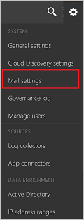

# <a name="general-setup"></a>Общая настройка
Ниже приведены инструкции по настройке [!INCLUDE[Adallom1](./includes/adallom1_md.md)] для работы в облачной среде.  
  
## <a name="prerequisites"></a>Предварительные условия  
  
-   Для использования продукта ваша организация должна иметь лицензию на Cloud App Security. Дополнительные сведения см. в статье [How to buy Cloud App Security](https://www.microsoft.com/server-cloud/products/cloud-app-security/default.aspx) (Приобретение Cloud App Security), а также ознакомьтесь со статьей [Licensing resources](https://www.microsoft.com/server-cloud/products/cloud-app-security/default.aspx) (Ресурсы по лицензированию).  
  
     Сведения о поддержке активации клиента см. в статье [Обращение в службу поддержки Office 365 для бизнеса: справка для администраторов](https://support.office.com/article/Contact-Office-365-for-business-support-Admin-Help-32a17ca7-6fa0-4870-8a8d-e25ba4ccfd4b).  
  
> [!NOTE] 
> Лицензия Office 365 не требуется для Cloud App Security.  
  
-   После приобретения лицензии на Cloud App Security вы получите сообщение электронной почты со сведениями об активации и ссылкой на портал Cloud App Security.  
  
-   Для настройки Cloud App Security необходимо быть глобальным администратором, администратором соответствия требованиям или администратором безопасности в Azure Active Directory или Office 365. Важно понимать, что пользователь, которому назначена роль администратора, будет иметь одни и те же разрешения во всех облачных приложениях, на которые подписалась ваша организация. При этом не важно, назначена ли роль на портале Office 365, на классическом портале Azure или с помощью модуля Azure AD для Windows PowerShell. Дополнительные сведения см. в статьях [Assigning admin roles in Office 365](https://support.office.com/article/Assigning-admin-roles-in-Office-365-eac4d046-1afd-4f1a-85fc-8219c79e1504) (Назначение пролей администратора в Office 365) и [Assigning administrator roles in Azure Active Directory](https://azure.microsoft.com/documentation/articles/active-directory-assign-admin-roles/) (Назначение пролей администратора в Azure Active Directory).  
  
-   Для работы с порталом Cloud App Security используйте Internet Explorer 11, Microsoft Edge (последней версии), Google Chrome (последней версии), Mozilla Firefox (последней версии) или Apple Safari (последней версии).  
  
-   ExpressRoute  
  
     Служба Cloud App Security развертывается в Azure и полностью интегрирована с [ExpressRoute](https://azure.microsoft.com/documentation/articles/expressroute-introduction/). Все взаимодействия с приложениями Cloud App Security и трафик, передаваемый в Cloud App Security, в том числе отправка журналов обнаружения, маршрутизируются через **открытый пиринг** ExpressRoute в целях снижения задержки, а также повышения производительности и безопасности. Со стороны клиента никаких действий по настройке не требуется.  
    Дополнительные сведения об открытом пиринге см. в статье [ExpressRoute circuits and routing domains](https://azure.microsoft.com/documentation/articles/expressroute-circuit-peerings/) (Цепи и домены маршрутизации ExpressRoute).  
  
## <a name="set-up-the-portal"></a>Настройка портала  
  
1.  Для доступа к порталу Cloud App Security перейдите по адресу [https://portal.cloudappsecurity.com](https://portal.cloudappsecurity.com).  
  
     Вы также можете использовать для этого **Центр администрирования Office 365**, щелкнув значок "Центры управления"  и выбрав **Cloud App Security**.  
  
       
  
2.  В строке меню на портале Cloud App Security щелкните значок параметров  и выберите пункт **Общие параметры**, чтобы настроить следующие параметры:  
  
3.  **Сведения об организации**  
  
     Важно указать **Отображаемое имя организации**. Оно будет отображаться в сообщениях электронной почты и на веб-страницах, отправляемых из системы.  
  
     Укажите **Имя среды** (клиент). Это особенно важно, если вы управляете несколькими клиентами.  
  
     Задайте список **Управляемые домены**. Управляемые домены помогают Cloud App Security определить, какие пользователи являются внутренними, а какие — внешними, а также куда можно или запрещено предоставлять файлы для общего доступа. Это используется для отчетов, а также для оповещений.  
> [!NOTE] 
> Пользователи, которые не настроены как внутренние, будут помечены как внешние, и их действия и файлы проверяться не будут.
   
Кроме того, можно указать **Логотип**, который будет отображаться в уведомлениях электронной почты и веб-страницах, отправляемых из системы. Логотип должен быть PNG-файлом размером до 150x50 пикселей на прозрачном фоне.  
  
4.  **Параметры конфиденциальности для письма с журналом действий**  
  
     При обнаружении сообщений электронной почты из Exchange Online можно настроить их отображение таким образом, чтобы соблюсти конфиденциальность. Для этого можно использовать параметр **Маскированная строка темы**, **Полная строка темы** или **Только по идентификаторам**.  
  
       
  
5.  **Язык и региональные стандарты**  
  
     Задайте для портала **Язык** по умолчанию. Чтобы изменить язык для отдельного администратора, выберите **Параметры пользователей** > **Настройки учетной записи**.  
  
       
  
     Задайте **Основной часовой пояс**. Cloud App Security постоянно анализирует и агрегирует данные. По умолчанию для портала Cloud App Security устанавливается часовой пояс UTC. Очень важно задать основной часовой пояс, который позволяет Cloud App Security точно регистрировать даты инцидентов в системе. Например, на диаграмме активности данные упорядочиваются по дате, которая зависит от часового пояса вашей системы, поэтому если вы не изменили часовой пояс по умолчанию, данные будут упорядочены по 24-часовым дням (согласно часовому поясу UTC), что может привести к рассинхронизации данных на несколько часов.  
  
       
  
6.  Если вы захотите создать резервную копию параметров портала, воспользуйтесь этим экраном. Нажмите кнопку "Экспортировать параметры портала" для создания JSON-файла со всеми параметрами портала, включая правила политики, группы пользователей и диапазоны IP-адресов.  
  
       
  
7.  Чтобы добавить дополнительных администраторов для Cloud App Security, щелкните значок параметров с шестеренкой  и выберите пункт **Управление административным доступом**. Добавьте администраторов, которым требуется доступ к Cloud App Security, и нажмите кнопку **Закрыть**.  
>[!NOTE]
>Любой не приглашенный пользователь (с соответствующей ролью: глобального администратора, администратора безопасности, администратора соответствия требованиям) может приглашать других пользователей в Cloud App Security.
  
  
  
##  <a name="a-nameadminsettingsa-customize-your-admin-settings"></a><a name="Adminsettings"></a> Настройка параметров администратора  
Чтобы задать для себя параметры администратора Cloud App Security, щелкните свое имя в строке меню портала и выберите пункт **Параметры пользователей** для настройки следующих параметров:  
  
1.  Щелкните **Параметры учетной записи**. Здесь можно настроить язык портала. Можно оставить язык портала по умолчанию или выбрать другой язык.  
  
       
  
2.  Щелкните **Уведомления** и настройте параметры уведомлений электронной почты и текстовых уведомлений для сообщений электронной почты, получаемых из системы.  Можно задать уровень серьезности для оповещений и нарушений, по которым требуется получать сообщения электронной почты. Серьезность задается для каждой политики, поэтому при появлении нарушений отправка уведомления зависит от настроенных здесь параметров и параметра серьезности, заданного в нарушенной политике. Сообщения электронной почты отправляются на псевдоним, связанный с учетной записью администратора, которую вы использовали для входа в Cloud App Security. Введите номер телефона, чтобы система Cloud App Security могла отправлять вам текстовые сообщения при выдаче оповещений и уведомлений, и задайте уровень серьезности, для которого требуется получать уведомления.  
  
> [!NOTE] 
> Максимальное количество оповещений, отправляемых в виде текстовых сообщений, составляет 10 оповещений на каждый номер телефона в день. Обратите внимание на то, что день вычисляется в соответствии с часовым поясом UTC. 
  
    
  
  
3. Завершив настройку, нажмите кнопку **Сохранить**.  
  
##  <a name="a-nameiptagsandrangesa-organize-the-data-according-to-your-needs"></a><a name="IPtagsandRanges"></a> Упорядочение данных в соответствии с потребностями  
Чтобы легко определять известные IP-адреса, например IP-адреса физического офиса, необходимо задать диапазоны IP-адресов, позволяющие использовать теги и классификацию, а также настроить способ отображения журналов и оповещений.   
Каждую группу диапазонов IP-адресов можно классифицировать по имеющемуся списку категорий IP-адресов или пометить собственными тегами IP-адресов. Кроме того, этот параметр позволяет переопределить открытые сведения о географическом положении с учетом сведений о внутренней сети.  
  
Поддерживаются форматы IPv4 и IPv6.  
  
В строке меню щелкните значок параметров  и выберите пункт **Диапазоны IP-адресов**. Щелкните **+Добавить диапазон IP-адресов** и укажите следующее:  
  
> [!NOTE]  
>  Параметры "Расположение" и "Зарегистрированный поставщик услуг Интернета" переопределяют значения по умолчанию.   
> при этом теги IP-адресов добавляются в действие без переопределения данных.  
  
1.  Назначьте **Имя** для диапазона IP-адресов. Оно не отображается в журнале действий, а используется только для управления вашим диапазоном IP-адресов.  
  
     Чтобы включить диапазон IP-адресов в категорию IP-адресов, выберите ее в раскрывающемся меню.  
  
2.  Введите **Диапазон IP-адресов**, который требуется настроить, и нажмите кнопку "+". Можно добавить любое число IP-адресов и подсетей, используя нотацию сетевых префиксов (которая также называется CIDR-нотацией), например 192.168.1.0/32.  
  
3.  Чтобы **переопределить поля расположения** или организации (поставщика услуг Интернета) для этих адресов, введите новое значение. Например, если имеется IP-адрес, который обычно относится к Ирландии, но вы знаете, что он находится в США, этот параметр можно переопределить.  
  
4.  Введите значение **Зарегистрированный поставщик услуг Интернета**. При этом переопределяются данные в ваших действиях.  
  
5.  Чтобы пометить тегом действия с этих IP-адресов, введите значение **Тег**. При вводе слова в этом поле создается тег. Уже настроенный тег можно легко добавить в дополнительные диапазоны IP-адресов, выбрав его из списка. Для каждого диапазона можно добавить любое число тегов IP-адресов. Теги IP-адресов можно использовать при создании политик.  
  
     Встроенные в Cloud App Security **теги IP-адресов** назначаются опасным адресам и постоянно обновляются. Эти теги охватывают анонимные прокси-серверы, спутниковые поставщики, узлы выхода Tor и сеть прокси-сервера Cloud App Security. Такие встроенные теги невидимы.  
  
6.  **Категории IP-адресов** позволяют легко распознавать действия с интересных IP-адресов. Эти категории доступны на портале, но пользователю требуется настроить их, указав включаемые в каждую из них IP-адреса, кроме категории "Рискованные", которая содержит два тега IP-адресов: для анонимного прокси-сервера и Tor.  
  
     Доступны следующие категории IP-адресов:  
  
    -   **Административные**: это должны быть IP-адреса администраторов.  
  
    -   **Внутренние**: это должны быть IP-адреса внутренней сети, филиалов и адреса роуминга Wi-Fi.  
  
    -   **Рискованные**: это должны быть IP-адреса, которые считаются опасными. Сюда могут входить подозрительные IP-адреса, с которыми вы уже сталкивались, IP-адреса в сетях ваших конкурентов и т. д.  
  
    -   **VPN**: это должны быть IP-адреса, используемые для удаленных работников.  
  
    -   **Облачный прокси-сервер**: это должен быть IP-адрес прокси-сервера в облаке.  
  
7.  Завершив настройку, нажмите кнопку **Создать**.  
  
       
  
##  <a name="a-nameadallommailsettingsa-personalize-your-experience"></a><a name="Adallom_mailsettings"></a> Персонализация работы  
В строке меню щелкните значок параметров  и выберите пункт **Параметры почты**, чтобы задать параметры для уведомлений электронной почты, отправляемых из Cloud App Security администраторам, запрашивающим предупреждения, и уведомлений, отправляемых конечным пользователям по поводу нарушений, к которым они имеют отношение.  
  
  
  
Необходимо установить:  
  
1.  **Адрес электронной почты отправителя**: учетная запись электронной почты, которую требуется использовать для отправки уведомления.  
  
     **Отображаемое имя отправителя**: имя, отображаемое в поле **От** сообщения электронной почты.  
  
     **Адрес электронной почты для ответа**: учетная запись электронной почты, используемая для ответов на сообщения.  
  
       
  
2.  Можно настроить и изменить структуру сообщений электронной почты, отправляемых из системы, с помощью HTML-файла. HTML-файл, используемый для шаблона, должен содержать следующее:  
  
    -   Все CSS должны быть встроены в шаблон.  
  
    -   Шаблон должен иметь три неизменяемых заполнителя:  
  
         %%logo%% — URL-адрес логотипа организации, который был отправлен на странице "Общие параметры".  
  
         %%title%% — заполнитель для заголовка сообщения электронной почты; задается политикой.  
  
         %%content%% — заполнитель для содержимого, которое будет включено для конечных пользователей; задается политикой.  
  
     Ниже приведен пример шаблона сообщения электронной почты:  
  
    ```  
    <!DOCTYPE html PUBLIC "-//W3C//DTD XHTML 1.0 Transitional//EN" "http://www.w3.org/TR/xhtml1/DTD/xhtml1-transitional.dtd">  
    <html>  
    <head>  
      <meta http-equiv="Content-Type" content="text/html; charset=UTF-8"/>  
      <meta name="viewport" content="width=device-width, initial-scale=1.0"/>  
    </head>  
    <body class="end-user">  
    <table border="0" cellpadding="20%" cellspacing="0" width="100%" id="background-table">  
      <tr>  
        <td align="center">  
          <!--[if (gte mso 9)|(IE)]>  
          <table width="600" align="center" cellpadding="0" cellspacing="0" border="0">  
            <tr>  
              <td>  
          <![endif]-->  
          <table bgcolor="#ffffff" align="center" border="0" cellpadding="0" cellspacing="0" style="padding-bottom: 40px;" id="container-table">  
            <tr>  
              <td align="right" id="header-table-cell">  
                  
              </td>  
            </tr>  
            <tr>  
              <td style="padding-top: 58px;" align="center" valign="top">  
                <table width="100%" cellpadding="12">  
                  <tr>  
                    <td align="center" class="round-title">  
                      %%title%%  
                    </td>  
                  </tr>  
                </table>  
              </td>  
            </tr>  
            <tr>  
              <td style="padding: 0 40px 79px 40px;" class="content-table-cell" align="left" valign="top">  
                  %%content%%  
              </td>  
            </tr>  
            <tr>  
              <td class="last-row"></td>  
            </tr>  
          </table>  
          <!--[if (gte mso 9)|(IE)]>  
          </td>  
          </tr>  
          </table>  
          <![endif]-->  
        </td>  
      </tr>  
    </table>  
    </body>  
    </html>  
  
    ```  
  
3.  Щелкните **Отправить шаблон...** и выберите созданный файл.  
  
     Щелкните **Отправить тестовое письмо**, чтобы отправить себе тестовое сообщение в качестве примера созданного шаблона.  
     Сообщение направляется в учетную запись, которую вы использовали для входа на портал. В тестовом сообщении можно просмотреть поля метаданных, шаблон, тему сообщения, заголовок в тексте сообщения и содержимое.  
  
## <a name="single-signon"></a>Единый вход  
Cloud App Security связывается с Azure Active Directory для выполнения действий, связанных с проверкой подлинности, подготовкой и лицензированием. Сведения об управлении единым входом см. в статье [Список совместимости с федерацией Azure Active Directory: использование сторонних поставщиков удостоверений для реализации единого входа](https://msdn.microsoft.com/library/azure/jj679342.aspx).  
  
## <a name="see-also"></a>См. также  
[Настройка Cloud Discovery](set-up-cloud-discovery.md)   
[Для получения технической поддержки посетите страницу службы технической поддержки Cloud App Security.](http://support.microsoft.com/oas/default.aspx?prid=16031)   
[Клиенты с поддержкой Premier также могут выбрать Cloud App Security непосредственно на портале Premier.](https://premier.microsoft.com/)  
  
  


<!--HONumber=Oct16_HO5-->


