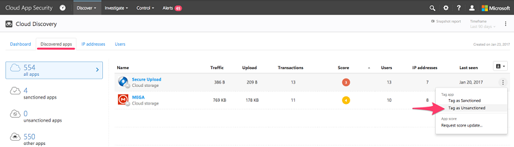

## Управление обнаруженными приложениями

После просмотра списка обнаруженных приложений вы можете принять указанные ниже меры, чтобы защитить среду от использования нежелательных приложений.

### Применение и отмена санкционирования приложения 

Вы можете отменить санкционирование определенного рискованного приложения, щелкнув многоточие в конце строки и выбрав **Отменить санкционирование**.
Это не запрещает работать с приложением, но позволяет проще контролировать его использование с помощью фильтров Cloud Discovery. Вы можете уведомить пользователей об отмене санкционирования для приложения и предложить альтернативный безопасный вариант.

  

Если имеется список приложений, для которых требуется применить или отменить санкционирование, выберите все нужные приложения с помощью флажков и выполните действие.

## Экспорт сценария блокирования для управления обнаруженными приложениями

Служба Cloud App Security позволяет блокировать доступ к несанкционированным приложениям, используя локальные программно-аппаратные комплексы безопасности. Создайте выделенный блок сценария и импортируйте его на своем программно-аппаратном комплексе.
Это решение не требует перенаправления всего веб-трафика организации на прокси-сервер.

1. В панели мониторинга Cloud App Security отметьте все приложения, которые нужно заблокировать, как **Несанкционированные**.

     

2. В строке заголовка щелкните многоточие и выберите команду **Создать сценарий блокирования...**. 

     

3. В окне **Создание сценария блокирования** выберите устройство для формирования сценария блокирования. 

     

4. Затем нажмите кнопку "Создать сценарий". Будет создан сценарий блокирования для всех несанкционированных приложений. По умолчанию файл будет назван по дате, когда он был экспортирован, и типу устройства, который вы выбрали, например *2017-02-19_CAS_Fortigate_block_script.txt* 

     

5. Импортируйте созданный файл на программно-аппаратный комплекс.

## См. также  
[Ежедневные мероприятия для защиты облачной среды](daily-activities-to-protect-your-cloud-environment.md)   

[Клиенты с поддержкой Premier также могут выбрать Cloud App Security непосредственно на портале Premier.](https://premier.microsoft.com/)  
  
  