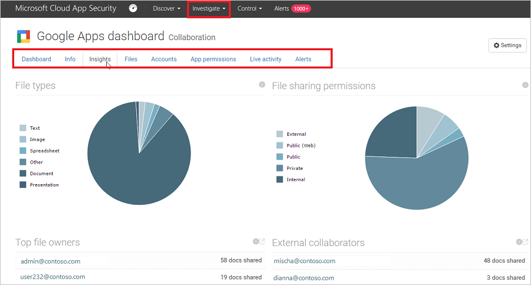

# Анализ
После запуска Cloud App Security в облачной среде потребуется произвести исследование и анализ использования средств Cloud App Security, чтобы лучше понять, что именно происходит в этой среде. После, основываясь на особенностях конкретной среды и ее использовании, можно определить требования, необходимые для защиты организации от рисков.

Этот раздел описывает проведение анализа, помогающего лучше понять облачную среду.  

## Панели мониторинга  
Следующие панели мониторинга помогут вам изучить приложения в облачной среде:  

|Панель мониторинга|Описание|  
|---------------|-----------------|  
|Основная панель мониторинга|Общие сведения о состоянии облака (пользователи, файлы и действия), а также необходимых действиях (оповещения, нарушения действий и содержимого)|  
|Панель мониторинга приложений: общие сведения|Обзор использования приложений в каждом месте, графики использования для нескольких пользователей|  
|Панель мониторинга приложений: ценные сведения|Анализ данных, хранящихся в приложении; разбивка по типу файлов и уровню совместного использования|  
|Панель мониторинга приложений: файлы|Детализация файлов, возможность фильтрации по владельцу, уровню совместного использования и т. д., а также выполнение действий системы управления (например, помещение в карантин)|  
|Панель мониторинга приложений: сторонние приложения|Детализация уже развернутых сторонних приложений, таких как G Suite, и определение политик для них|  
|Панель мониторинга пользователя|Полный обзор профиля пользователя в облаке, включая группы, расположения, последние действия, связанные оповещения и использованные браузеры|  

##   Отметка приложений как санкционированных или несанкционированных  
Важный шаг в процессе понимания работы облака — отмечать приложения как санкционированные или несанкционированные. После санкционирования приложения можно отфильтровать несанкционированные приложения и запустить миграцию на санкционированные приложения аналогичного типа.  

-   В консоли Cloud App Security перейдите в каталог приложений или в раздел Discovered apps (Обнаруженные приложения).  

-   В списке приложений на строке с приложением, которое вы хотите отметить как санкционированное, выберите многоточие в конце строки  и выберите **Mark as sanctioned** (Отметить как санкционированное).  

       

## Использование средств для исследования  

1.  На портале Cloud App Security выберите **Сведения** и просмотрите **Журнал действий** и фильтр для конкретного приложения. Проверьте соблюдение перечисленных ниже условий.  

    -   Кто получает доступ к облачной среде?  

    -   Из каких диапазонов IP-адресов?  

    -   Что делает администратор?  

    -   Из каких расположений подключаются администраторы?  

    -   Подключаются ли к облачной среде какие-либо устаревшие устройства?  

    -   Неудачные попытки входа поступают с ожидаемых IP-адресов?  

2.  Выберите **Сведения**, **Файлы** и проверьте следующее:  

    -   Сколько файлов открыто для общего доступа, так что любой пользователь может обратиться к ним без ссылки?  

    -   С какими партнерами вы обмениваетесь файлами (исходящий общий доступ)?  

    -   Есть ли у каких-нибудь файлов конфиденциальное имя?  

    -   Используется ли чья-то личная учетная запись для общего доступа к файлам?  

3.  Выберите **Сведения**, **Учетные записи** и проверьте следующее:  

    -   Были ли какие-нибудь учетные записи неактивны в определенной службе в течение длительного времени? (Можете ли вы отозвать лицензию на эту службу для этого пользователя?)  

    -   Хотите ли вы знать, какие пользователи имеют определенную роль?  

    -   Был ли уволен сотрудник, который мог сохранить доступ к приложению и использовать его для кражи информации?  

    -   Хотите ли вы отменить разрешение пользователя на определенное приложение или потребовать от конкретного пользователя прохождения многофакторной проверки подлинности?  
    
    -   Можно также перейти к учетной записи пользователя, щелкнув шестеренку в конце строки учетной записи пользователя и выбрав действие, например **Приостановить пользователя** или **Remove user's collaborations** (Удалить совместную работу пользователя). Если пользователь был импортирован из Azure Active Directory, можно также щелкнуть **Параметры учетной записи Azure AD**, чтобы получить доступ к расширенным функциям управления пользователями, таким как управление группами, многофакторная идентификация, сведения о входах пользователя и возможность блокировать вход.

4.  Выберите **Сведения** и затем приложение. Откроется панель мониторинга приложений, на которой будут предоставлены сведения и ценная информация. Вы можете использовать вкладки сверху, чтобы проверить следующее.  

       

    -   Какие устройства используют пользователи для подключения к приложению?  

    -   Какие типы файлов они сохраняют в облаке?  

    -   Какие действия выполняются в приложении прямо сейчас?  

    -   Есть ли в вашей среде подключенные сторонние приложения?  

    -   Известно ли вам об этих приложениях?  

    -   Авторизованы ли они для предоставленного им уровня доступа?  

    -   У скольких пользователей они развернуты? Насколько часто они встречаются?  

5.  Перейдите на **панель мониторинга Cloud Discovery** и проверьте следующее:  

    -   Какие облачные приложения используются, насколько активно и кем?  

    -   Для каких целей они используются?  

    -   Какой объем данных отправляется в эти облачные приложения?  

    -   В каких категориях у вас присутствуют санкционированные облачные приложения, но пользователи работают с альтернативными решениями?  

    -   Хотите ли вы отменить санкционирование облачных приложений в своей организации для альтернативных решений?  

    -   Существуют ли используемые облачные приложения, которые не соответствуют политике вашей организации?  

## Использование отчетов для исследования рисков  
Начиная управлять облачной средой, вы делаете определенные предположения, исходя из ожидаемых результатов, так как еще мало знаете о своем облаке. На основе этих допущений вы создаете политики.

После запуска Cloud App Security в облачной среде вы используете встроенные отчеты (а также пользовательские отчеты), чтобы увидеть, что происходит в облаке. На основе этого вы повторно настраиваете политики, добавив исключения, чтобы в результате количество ложных срабатываний в политике было мало.  

Встроенные отчеты предоставляют агрегированные представления для изучения. Для работы со встроенными отчетами выберите пункт **Сведения**, а затем — **Встроенные отчеты**. Дополнительные сведения о различных встроенных отчетах см. в статье [Справочник по встроенным отчетам](built-in-report-reference.md).  

## Пример исследования  
Предположим, вы считаете, что к вашей облачной среде не осуществляется доступ с подверженных риску IP-адресов (например, с анонимных прокси-серверов и через Tor). Но на всякий случай вы создаете политику для опасных IP-адресов:  

1.  На портале перейдите в раздел **Управление** и выберите **Политики**.  

2.  В **Центре политик** откройте вкладку **Шаблоны**.  

3.  В конце строки **Вход пользователя с IP-адреса, не имеющего категории** щелкните знак "плюс" **+** для создания политики.  

4.  Измените имя политики, чтобы вы могли узнать ее.  

5.  В разделе **Фильтры действий** щелкните **+** для добавления фильтра. Прокрутите страницу вниз до элемента **Тег IP-адреса**, а затем выберите пункты **Анонимный** и **Tor**.  

       

Теперь, когда политика готова, вы с удивлением получаете оповещение о нарушении политики.  

1.  Перейдите на страницу **Оповещения** и просмотрите оповещение о нарушении политики.  

2.  Если это действительно нарушение, следует устранить его или снизить риск.  

     Чтобы снизить риск, можно отправить пользователю уведомление с вопросом о том, было ли нарушение намеренным и знал ли о нем пользователь.  

     Можно также детализировать оповещение и приостановить действие учетной записи пользователя до выяснения обстоятельств и требуемых мер.  

3.  Если это допустимое событие, которое вряд ли повторится, оповещение можно проигнорировать.  

     Если это допустимое событие, которое, возможно, будет повторяться, можно изменить политику, чтобы в будущем подобное событие не считалось нарушением.  

## См. также:  
Сведения об управлении облачным приложением организации см. в разделе [Управление](control.md).   
Для получения технической поддержки перейдите на страницу [Служба технической поддержки Cloud App Security](http://support.microsoft.com/oas/default.aspx?prid=16031).  
Клиенты с поддержкой Premier также могут выбрать Cloud App Security непосредственно на [портале Premier](https://premier.microsoft.com/).  
