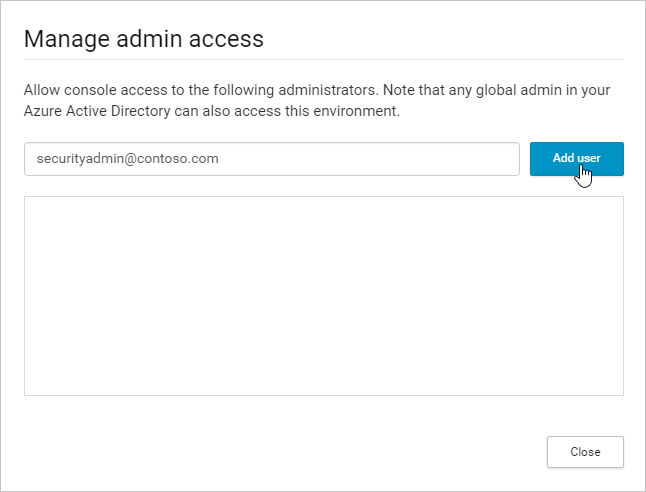

## Управление доступом администратора

Cloud App Security поддерживает управление доступом на основе ролей. По умолчанию доступ к Cloud App Security имеют следующие роли администратора Office 365 и Azure AD:

- Глобальный администратор и администратор безопасности. Администраторы с **правами полного доступа** в Cloud App Security могут добавлять администраторов, параметры и политики, а также отправлять журналы и выполнять действия управления.

- Администратор соответствия требованиям. Имеет разрешения только на чтение и может управлять оповещениями. Может создавать и изменять политики файлов, разрешать действия системы управления файлами и просматривать все встроенные отчеты в разделе "Управление данными". 

- Читатель безопасности. Имеет разрешения только на чтение и может управлять оповещениями. Читателю безопасности запрещено выполнять следующие действия.
      - Создавать новые политики и изменять существующие 
      - Выполнять любые действия управления 
      - Передавать журналы обнаружения
      - Блокировать или утверждать приложения третьей стороны
      - Открывать и просматривать страницу параметров диапазона IP-адресов
      - Открывать и просматривать любые страницы параметров 
      - Открывать и просматривать параметры обнаружения 
      - Открывать и просматривать страницу соединителей приложения
      - Открывать и просматривать журнал управления 
      - Открывать и просматривать страницу управления отчетами о снимках 

Дополнительные сведения см. в статье [Назначение ролей администратора в Azure Active Directory](https://docs.microsoft.com/en-us/azure/active-directory/active-directory-assign-admin-roles).

Можно также добавлять дополнительных администраторов в Cloud App Security без добавления пользователей в административные роли Azure Active Directory. Для этого выполните следующие действия.

1. Щелкните значок параметров с шестеренкой  и выберите пункт **Управление административным доступом**. 

2. Добавьте администраторов, которым требуется доступ к Cloud App Security.
  
      
3. Затем щелкните раскрывающийся список, чтобы определить тип доступа для администратора: **Полный доступ** или **"Только для чтения" и "Управление оповещениями"**.

     >[!NOTE]
      >Все администраторы, права доступа которых ограничены ролью **"Только для чтения" и "Управление оповещениями"**, при обращении к странице с ограниченным доступом или попытке выполнить запрещенное действие получат сообщение о том, что у них нет разрешения на доступ к странице или выполнение действия.

     

4. Нажмите кнопку **Закрыть**.  

   >[!NOTE]
    >Предоставлять другим пользователям доступ к Cloud App Security могут только глобальные администраторы и администраторы безопасности.
  
**Вот как переопределить разрешения администратора:**

Чтобы переопределить разрешение администратора Azure Active Directory или Office 365, добавьте пользователя вручную в Cloud App Security или назначьте ему разрешения.
Например, если вы хотите назначить Светлане с ролью читателя безопасности в Azure Active Directory **полный доступ** в Cloud App Security, добавьте ее вручную в Cloud App Security и назначьте ей **полный доступ**, чтобы переопределить ее роль и предоставить ей нужные разрешения в Cloud App Security. 

Вот как добавить администраторов в Cloud App Security:
1. Щелкните значок параметров с шестеренкой  и выберите пункт **Управление административным доступом**. 

2. Добавьте администраторов, которым требуется доступ к Cloud App Security, выберите их уровень доступа и нажмите кнопку **Закрыть**.

## См. также  
[Настройка Cloud Discovery](set-up-cloud-discovery.md)   
[Для получения технической поддержки посетите страницу службы технической поддержки Cloud App Security.](http://support.microsoft.com/oas/default.aspx?prid=16031)   
[Клиенты с поддержкой Premier также могут выбрать Cloud App Security непосредственно на портале Premier.](https://premier.microsoft.com/)  
  
  