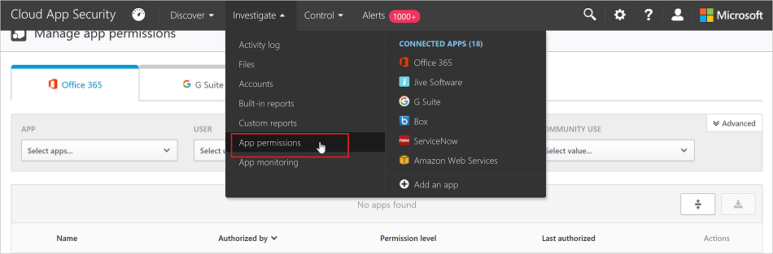
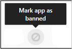

# Управление разрешениями приложения
Многим приложениям независимых разработчиков, которые могут устанавливаться бизнес-пользователями в вашей организации, необходимы разрешение на доступ к информации о пользователях и данных и возможность входа от имени пользователя в другие облачные приложения, такие как Office 365.  При установке этих приложений пользователи часто нажимают кнопку "Принять", не обращая внимания на сообщение, в том числе на разрешения, предоставляемые приложению.  Проблема усугубляется тем, что ИТ-отдел может не иметь достаточной информации для сопоставления рисков для безопасности при использовании приложения с преимуществами в производительности, которые оно предоставляет. Так как предоставление разрешений приложениям независимых разработчиков представляет потенциальную угрозу безопасности для организации, мониторинг и контроль разрешений, которые предоставляют пользователи, позволяет защитить пользователей и приложения в вашей организации. Включение разрешений Cloud App Security позволяет увидеть, какие установленные пользователем приложения имеют доступ к данным Office 365, какие разрешения есть у приложений и какие пользователи предоставили этим приложениям доступ к своим учетным записям Office 365. Справка по разрешениям приложения позволит решить, доступ пользователей к каким приложениям нужно разрешить, а к каким заблокировать.

## Страница разрешений приложения

На вкладке **Разрешения приложения** отображаются сведения о разрешениях приложения в клиенте Office 365.

Для доступа к вкладке "Разрешения приложения" выполните следующие действия.

На портале Cloud App Security последовательно щелкните **Исследовать** и **Разрешения приложения**.

 

На странице "Разрешения приложения" представлены следующие сведения о каждом стороннем приложении, которому были даны разрешения:

|Элемент|Что означает|
|-------|----------------|
|Значок "Основное" на панели запроса приложения  |Выберите этот значок, чтобы открыть запрос в представлении "Основное".|
|Значок "Расширенное" на панели запроса приложения  |Выберите этот значок, чтобы открыть запрос в представлении "Расширенное".|
|Значок "Открыть или закрыть все сведения" в списке приложений  |Выберите этот значок, чтобы отображалось больше или меньше сведений о каждом приложении.|
|Значок экспорта в списке приложений  |Выберите этот значок, чтобы экспортировать CSV-файл, содержащий список приложений, число пользователей для каждого приложения, разрешения, связанные с приложением, уровень разрешений, состояние приложения и уровень использования сообществом.|
|Приложение|Имя приложения Выберите имя приложения для просмотра дополнительных сведений, включающих описание, издателя, веб-сайт и идентификатор приложения.|
|Кем авторизовано|Число пользователей, которые дали этому приложению доступ к своей учетной записи Office 365 и предоставили приложению разрешения. Выберите число пользователей для просмотра дополнительных сведений, включающих список адресов электронной почты пользователей и информацию о ранее предоставленных системным администратором разрешениях.|
|Уровень разрешений  |Значок "Уровень разрешений" и текст, указывающий на уровень разрешений: "Высокий", "Средний" или "Низкий". Этот уровень отражает степень доступа приложения к данным Office 365. Например, низкий уровень может означать, что приложение обращается только к профилю пользователя и имени пользователя. Выберите уровень, чтобы просмотреть дополнительные сведения, включающие разрешения, предоставленные приложению, использование сообществом или соответствующие действия в [Журнале управления](governance-actions.md).|
|Состояние приложения: "Заблокировано", "Одобрено" или "Не определено".  |Администратор может пометить приложение как одобренное, заблокированное или оставить его в состоянии "Не определено".|

## Заблокировать или одобрить приложение
1. На странице "Разрешения приложения" щелкните приложение, чтобы открыть контейнер приложения и просмотреть дополнительные сведения о приложении и разрешениях, которые были ему предоставлены. Щелкнув ссылку "Разрешения", можно просмотреть полный список разрешений, предоставленных приложению. В разделе "Использование сообществом" можно просмотреть, насколько широко приложение используется в других организациях. Щелкнув ссылку "Сопутствующая активность", можно просмотреть действия в журнале управления, связанные с этим приложением.
2. Чтобы заблокировать приложение, щелкните значок блокировки приложения в конце строки приложения в таблице.   
    
При блокировке приложения можно выбрать, нужно ли сообщить пользователям о том, что ранее установленное и одобренное ими приложение будет заблокировано и потеряет доступ к Office 365. Если вы не хотите сообщать пользователям о блокировке приложения, снимите флажок "Уведомить пользователей, предоставивших доступ заблокированному приложению" в диалоговом окне "Блокировка приложения".

    
> [!Note]
> Рекомендуется сообщать пользователям о блокировке одобренного ими приложения.

3. Чтобы одобрить приложение, щелкните значок одобрения приложения в конце строки в таблице.   
    
Значок состояния станет зеленым, и приложение будет доступно для всех пользователей Office 365.
> [!Note]
> Одобрение приложения никак не повлияет на конечных пользователей. Оно только позволяет визуально отделить приложения, которые вы одобрили, от приложений, к которым вы еще не обращались.

3. Введите сообщение, которое вы хотите отправить пользователям, в поле "Введите пользовательское сообщение для уведомления" и измените адрес в поле "Адрес электронной почты для ответа" при необходимости. 
 Щелкните **Заблокировать приложение**, чтобы отправить письмо и заблокировать приложение для пользователей Office 365.

## Запрос разрешений приложения

### Расширенное представление запроса 
1. В расширенном представлении сократите область поиска с помощью раскрывающегося списка **Выбор фильтра**. Дополните запрос, добавив операторы и проверки на равенство или неравенство для указанных значений.
2. Выберите значок **Добавить фильтр**, чтобы добавить дополнительные фильтры для дальнейшего уточнения запроса. Фильтры применяются автоматически, и список приложений обновляется соответствующим образом.
3. Выберите значок **Удалить фильтр** рядом с фильтром, чтобы удалить фильтры.
Для выбора доступны следующие фильтры.
- "Приложение". Отображает сторонние приложения с выбранными названиями, которым был предоставлен доступ к Office 365.

- "Пользователь". Отображает приложения, которым предоставил разрешения этот пользователь.

- "Разрешения". Отображает приложения, которым необходимы выбранные разрешения.

- "Состояние приложения". Отображает приложения на основе их состояния: "Одобрено", "Заблокировано" или "Не определено".

- "Уровень разрешений". Отображает приложения на основе выбранных уровней разрешений.

- "Использование сообществом". Отображает приложения по уровню использования сообществом: "Редко", "Нечасто" или "Часто".

### Основное представление запроса 
Для отображения приложений в основном представлении выберите значения из одного или нескольких раскрывающихся списков. В каждом раскрывающемся списке можно выбрать несколько значений. Для запроса можно использовать следующие раскрывающиеся меню. 
- "Приложение". Отображает сторонние приложения с выбранными названиями, которым был предоставлен доступ к Office 365.

- "Пользователь". Отображает приложения, которым предоставил разрешения этот пользователь.

- "Разрешения". Отображает приложения, которым необходимы выбранные разрешения.

- "Состояние приложения". Отображает приложения на основе их состояния: "Одобрено", "Заблокировано" или "Не определено".

- "Уровень разрешений". Отображает приложения на основе выбранных уровней разрешений.

- "Использование сообществом". Отображает приложения по уровню использования сообществом: "Редко", "Нечасто" или "Часто".
Фильтры применяются автоматически, и список приложений обновляется соответствующим образом. 

## См. также  
[Управление облачными приложениями с помощью политик](control-cloud-apps-with-policies.md)   
[Для получения технической поддержки посетите страницу службы технической поддержки Cloud App Security.](http://support.microsoft.com/oas/default.aspx?prid=16031)   
[Клиенты с поддержкой Premier также могут выбрать Cloud App Security непосредственно на портале Premier.](https://premier.microsoft.com/)  
  
  