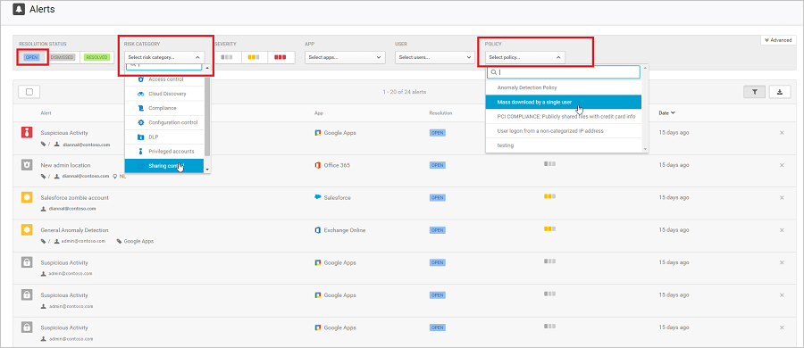

## Управление оповещениями  
Оповещения являются ключом к более глубокому пониманию облачной среды. На основе полученных результатов можно создавать новые политики. Например, вы можете заметить, что один из администраторов выполнил вход из Гренландии, но раньше никто в вашей организации не выполнял вход из этого региона. Вы можете создать политику, которая автоматически приостанавливает действие учетной записи администратора, если она используется для входа из этого местоположения.  

Рекомендуется просматривать все оповещения и руководствоваться ими при изменении политик. Если безобидные события расцениваются как нарушение политик, уточните политики, чтобы уменьшить число ненужных предупреждений.  

1.   В разделе **Открытые оповещения** щелкните **Просмотреть все оповещения**.  

     В этом разделе панели мониторинга предоставляются полные сведения о подозрительных действиях или нарушениях установленных политик. Впоследствии они позволяют упрочить защиту, настроенную для облачной среды.  

       

2.   Для каждого оповещения следует провести расследование и определить характер нарушения и необходимые меры.  

     Вы можете фильтровать оповещения по параметрам "Тип оповещений" или "Серьезность", чтобы сначала обрабатывать наиболее важные из них.  

     Выберите определенное оповещение. В зависимости от его типа вам будут предложены различные действия, которые можно выполнить до разрешения оповещения.  

     Существует три типа нарушений, с которыми приходится сталкиваться при анализе оповещений:  

    #### Серьезные нарушения
     Серьезные нарушения требуют незамедлительного реагирования.

         Examples:  

         For a suspicious activity alert, you might want to suspend the account until the user changes their password.  

         For a data leak you might want to restrict permissions or quarantine the file.  

         If a new app is discovered, you might want to block access to the service on your proxy or firewall.  

    #### Сомнительные нарушения
    Сомнительные нарушения требуют дополнительного анализа.  

         You can contact the  user or the user's manager about the nature of the activity.  

         Leave the activity open until you have more information.  

 #### Авторизованные нарушения или аномальное поведение
 Авторизованные нарушения или аномальное поведение могут быть вызваны правомерным использованием.  

         Dismiss the alert.  

3.   После завершения этого процесса пометьте оповещение как разрешенное.  

Следующая таблица содержит список возможных типов оповещений и рекомендации по их разрешению.  

|Тип оповещения|Описание|Рекомендуемое разрешение|  
|----------------|-----------------|----------------------------|  
|Нарушение политики действий|Этот тип оповещения выдается созданной вами политикой.|Для массовой обработки оповещений этого типа рекомендуется устранять их через Центр политик.   Настройте политику для исключения часто срабатывающих сущностей, добавив дополнительные фильтры и более детальные элементы управления.   Если политика точна, оповещение было обосновано и это нарушение нужно немедленно прекратить, рекомендуется добавить в политику автоматическое исправление.|  
|Нарушение политики файлов|Этот тип оповещения выдается созданной вами политикой.| Для массовой обработки оповещений этого типа рекомендуется устранять их через Центр политик.   Настройте политику для исключения часто срабатывающих сущностей, добавив дополнительные фильтры и более детальные элементы управления.   Если политика точна, оповещение было обосновано и это нарушение нужно немедленно прекратить, рекомендуется добавить в политику автоматическое исправление.|  
|Скомпрометированная учетная запись|Оповещение этого типа активируется, когда Cloud App Security выявляет учетную запись, которая была скомпрометирована (очень велика вероятность того, что учетная запись использовалась недопустимым образом).|Рекомендуется приостановить действие учетной записи до тех пор, пока вы не сможете связаться с пользователем и убедиться, что он сменил пароль.|  
|Неактивная учетная запись|Это оповещение активируется, когда учетная запись не используется в течение 60 дней в одном из подключенных облачных приложений.|Свяжитесь с пользователем и его руководителем, чтобы определить, активна ли эта учетная запись. Если она неактивна, приостановите действие учетной записи пользователя и прекратите действие лицензии для приложения.|  
|Новый пользователь-администратор|Оповещает вас об изменениях в привилегированных учетных записях для подключенных приложений.|Убедитесь, что новые разрешения администратора действительно нужны пользователю. Если это не так, рекомендуется отозвать права администратора для снижения риска.|  
|Новое расположение администратора|Оповещает вас об изменениях в привилегированных учетных записях для подключенных приложений.|Убедитесь, что вход из этого аномального местоположения был допустим. Если это не так, рекомендуется отозвать права администратора или приостановить действие учетной записи для снижения риска.|  
|Новое расположение|Это информационное оповещение о доступе к подключенному приложению из нового расположения, активируемое всего один раз для каждой страны.|Проанализируйте действия данного конкретного пользователя.|  
|Новая обнаруженная служба|Это оповещение о теневых ИТ-ресурсах — функция Cloud Discovery обнаружила новое приложение.|<ul><li>Оцените риск службы по каталогу приложений.</li><li>Детализируйте действие для определения закономерностей и распространенности.</li><li>Решите, следует ли применить или отменить санкционирование приложения.</li> </ul>Для несанкционированных приложений:  <ul><li>Может потребоваться заблокировать использование на прокси-сервере или в брандмауэре.</li><li>Если приложение не санкционировано и есть санкционированное приложение в той же категории, можно экспортировать список пользователей несанкционированного приложения, после чего связаться с ними и перевести их в санкционированное приложение.</li></ul></li>|  
|Подозрительная активность|Это оповещение сообщает вам об обнаружении аномальной активности, которая не соответствует ожидаемым действиям или пользователям в организации.|Проанализируйте такое поведение и подтвердите его у пользователя.   Оповещения этого типа отлично подходят для изучения среды и создания политик на их основе. Например, если кто-то вдруг отправляет большой объем данных в одно из подключенных приложений, можно настроить правило для управления таким аномальным поведением.|  
|Оповещение о подозрительном использовании облака|Это оповещение сообщает вам об обнаружении аномальной активности, которая не соответствует ожидаемым действиям или пользователям в организации.|Проанализируйте такое поведение и подтвердите его у пользователя.   Оповещения этого типа отлично подходят для изучения среды и создания политик на их основе. Например, если кто-то вдруг отправляет большой объем данных в одно из подключенных приложений, можно настроить правило для управления таким аномальным поведением.|  
|Use of personal account (Использование личной учетной записи)|Это оповещение сообщает вам о том, что новая личная учетная запись имеет доступ к ресурсам в подключенных приложениях.|Удалите объекты данных совместной работы пользователя во внешней учетной записи.|  

## Дальнейшие действия  
Дополнительные сведения об исследовании оповещений см. в разделе [Сведения](investigate.md).  

Клиенты с поддержкой Premier также могут выбрать Cloud App Security непосредственно на [портале Premier](https://premier.microsoft.com/).  
