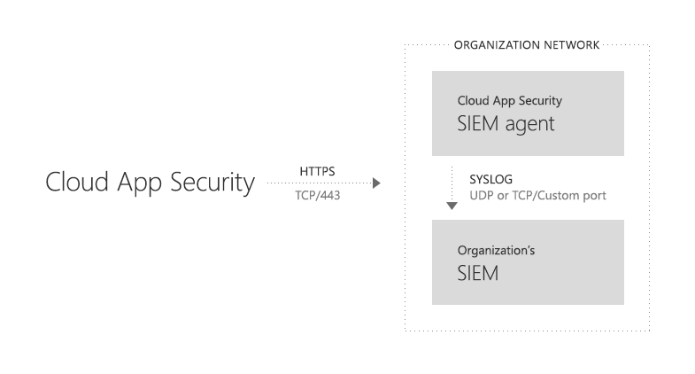
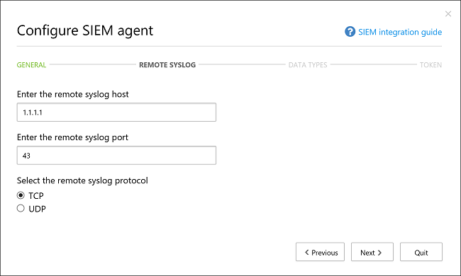
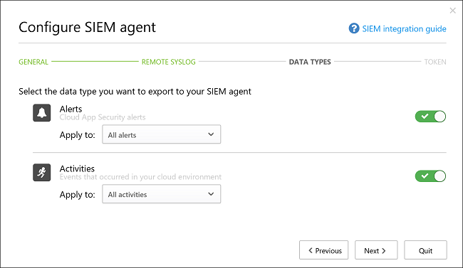

# <a name="siem-integration"></a>Интеграция SIEM
    
Теперь можно интегрировать Cloud App Security с сервером SIEM. Это обеспечит централизованный мониторинг оповещений и действий Office 365. По мере добавления поддержки для новых действий и событий в Office 365 они отображаются и в Cloud App Security. Интеграция со службой SIEM позволяет повысить степень защищенности облачных приложений без изменения обычного рабочего процесса обеспечения безопасности путем автоматизации процедуры системы безопасности и установления взаимосвязей между действиями в облаке и локальной среде. Агент SIEM Cloud App Security работает на сервере, запрашивает оповещения и действия от Cloud App Security и передает их на сервер SIEM.

При первой интеграции SIEM с Cloud App Security в SIEM будут перенаправлены действия и оповещения за последние два дня, а также все последующие действия и оповещения в зависимости от выбранного вами фильтра. Кроме того, если вы отключите эту функцию на длительное время, то при повторном включении будут перенаправлены действия и оповещения за последние два дня и все последующие.

## <a name="siem-integration-architecture"></a>Архитектура интеграции SIEM

Агент SIEM развертывается в сети организации. При развертывании и настройке он запрашивает типы данных (оповещения и действия), настроенные с помощью интерфейсов RESTful API Cloud App Security.
После этого трафик отправляется через зашифрованный HTTPS-канал на порту 443.

После получения данных из Cloud App Security агент SIEM отправляет сообщения системного журнала в локальную среду SIEM с помощью сетевой конфигурации, указанной во время установки (TCP или UDP с настраиваемым портом). 




## <a name="how-to-integrate"></a>Интеграция

Интеграция SIEM выполняется в три этапа:
1. Настройка SIEM на портале Cloud App Security. 
2. Скачивание JAR-файла и его запуск на сервере.
3. Проверка работы агента SIEM.

### <a name="prerequisites"></a>Предварительные условия

- Стандартный сервер с Windows или Linux (можно использовать виртуальную машину).
- На сервере должна быть запущена Java 8; более ранние версии не поддерживаются.

## <a name="integrating-with-your-siem"></a>Интеграция SIEM

### <a name="step-1-set-it-up-in-the-cloud-app-security-portal"></a>Шаг 1: настройка SIEM на портале Cloud App Security

1. На портале Cloud App Security под шестеренкой "Параметры" щелкните **Расширения безопасности** и откройте вкладку **Агенты SIEM**.

2. Щелкните значок "плюс", чтобы запустить мастер **Добавить агент SIEM**.
3. В окне мастера щелкните **Add SIEM agent** (Добавить агент SIEM). 
4. В окне мастера введите название и **выберите формат SIEM**, а также укажите любые **дополнительные параметры** для этого формата. Нажмите кнопку **Далее**.

   

5. Введите IP-адрес или имя **узла с удаленным системным журналом** и **номер порта для системного журнала**. Выберите TCP или UDP в качестве протокола для удаленного системного журнала.
Если у вас нет этих данных, их можно получить у вашего администратора по безопасности.
Нажмите кнопку **Далее**.
  

6. Выберите типы данных, **оповещения** и **действия**, которые нужно экспортировать на сервер SIEM. Включите или отключите их при помощи ползунка. По умолчанию выбраны все типы. Для отправки только определенных типов оповещений и действий на сервер SIEM можно воспользоваться фильтрами из раскрывающегося списка **Apply to** (Применить к).
Чтобы проверить правильность работы фильтра, можно нажать кнопку **Edit and preview results** (Изменить и показать результаты). Нажмите кнопку **Далее**. 

  

7. Скопируйте токен и сохраните его для последующего использования. После нажатия кнопки "Готово" и завершения работы мастера агент SIEM, добавленный в таблице, отобразится на странице SIEM. Этот агент будет иметь состояние **Created** (Создан). Впоследствии он будет подключен.

### <a name="step-2-download-the-jar-file-and-run-it-on-your-server"></a>Шаг 2: скачивание JAR-файла и его запуск на сервере

1. [Скачайте ZIP-файл из Центра загрузки Microsoft](https://go.microsoft.com/fwlink/?linkid=838596) и распакуйте его.

2. Извлеките JAR-файл из ZIP-файла и запустите его на сервере.
 После запуска файла выполните следующую команду:
    
      java -jar mcas-siemagent-0.87.20-signed.jar [--logsDirectory DIRNAME] [--proxy ADDRESS[:PORT]] --token TOKEN
> [!NOTE]
> - Имя файла зависит от версии агента SIEM.
> - Параметры в квадратных скобках [] необязательные; их следует использовать только при необходимости.
> - При работе в Windows рекомендуется настроить запланированную задачу для выполнения команды. Это гарантирует, что служба всегда будет работать.

Где используются следующие переменные:
- DIRNAME — это путь к каталогу, который вы хотите использовать для журналов отладки локального агента.
- Адрес[:порт] — адрес прокси-сервера и порт, которые сервер использует для подключения к Интернету.
- Токен — токен агента SIEM, скопированный на предыдущем шаге.

Чтобы получить справку, введите -h. Эта команда доступна всегда.

Вот примеры журналов действий, отправляемых в службу SIEM:
```
    2017-07-11T19:14:55.895Z CEF:0|MCAS|SIEM_Agent|0.102.17|EVENT_CATEGORY_LOGIN|Log on|0|externalId=1499800495894_e453bc33-a7c1-48f7-8397-8ae8e2758183 start=1499800495895 end=1499800495895 msg=Log on suser=admin@contoso.com destinationServiceName=Microsoft Exchange Online dvc=13.82.149.151 requestClientApplication=Mozilla/5.0 (Windows NT 10.0; Win64; x64) AppleWebKit/537.36 (KHTML, like Gecko) Chrome/59.0.3071.115 Safari/537.36 machine_id_149980022970038514 cs1Label=portalURL cs1=https://cloud-app-security.com/#/audits?activity.id\=eq(1499800495894_e453bc33-a7c1-48f7-8397-8ae8e2758183,) cs2Label=uniqueServiceAppIds cs2=APPID_OUTLOOK cs3Label=targetObjects cs3=admin@contoso.com c6a1Label="Device IPv6 Address" c6a1=
    2017-07-11T19:14:56.781Z CEF:0|MCAS|SIEM_Agent|0.102.17|EVENT_CATEGORY_DOWNLOAD_FILE|Download file|0|externalId=1499800496781_2e50118e-dee7-40d7-b912-b81a10feed28 start=1499800496781 end=1499800496781 msg=Download file: file name50280117yyct6t.xlsx suser=roy@adallom.com.test destinationServiceName=Salesforce dvc=13.82.149.151 requestClientApplication=Mozilla/5.0 (Windows NT 10.0; Win64; x64) AppleWebKit/537.36 (KHTML, like Gecko) Chrome/59.0.3071.115 Safari/537.36 machine_id_149979855250880034 cs1Label=portalURL cs1=https://cloud-app-security/#/audits?activity.id\=eq(1499800496781_2e50118e-dee7-40d7-b912-b81a10feed28,) cs2Label=uniqueServiceAppIds cs2=APPID_SALESFORCE cs3Label=targetObjects cs3=name50280117yyct6t.xlsx c6a1Label="Device IPv6 Address" c6a1=
    2017-07-11T19:16:04.666Z CEF:0|MCAS|SIEM_Agent|0.102.17|EVENT_CATEGORY_SSO_LOGIN|Single sign-on log on|0|externalId=1499800564666_06496600-edde-4d81-a995-7632e70fb24f start=1499800564666 end=1499800564666 msg=Single sign-on log on suser=admin@contoso.com destinationServiceName=Microsoft Online Services dvc=13.82.149.151 requestClientApplication=Mozilla/5.0 (Windows NT 10.0; Win64; x64) AppleWebKit/537.36 (KHTML, like Gecko) Chrome/59.0.3071.115 Safari/537.36 machine_id_149980039637481908 cs1Label=portalURL cs1=https://cloud-app-security.com/#/audits?activity.id\=eq(1499800564666_06496600-edde-4d81-a995-7632e70fb24f,) cs2Label=uniqueServiceAppIds cs2=APPID_11394 cs3Label=targetObjects cs3=admin@contoso.com c6a1Label="Device IPv6 Address" c6a1=
    2017-07-12T13:28:29.067Z CEF:0|MCAS|SIEM_Agent|0.102.17|EVENT_CATEGORY_DOWNLOAD_FILE|Download file|0|externalId=1499866109067_8e3fae2c-ca5b-4163-84b6-fb9a03c4d052 start=1499866109067 end=1499866109067 msg=Download file: file CC004.txt suser=admin@box-contoso.com destinationServiceName=Box dvc=194.69.102.134 requestClientApplication=Mozilla/5.0 (Linux; Android 7.0; SAMSUNG SM-G930F Build/NRD90M) AppleWebKit/537.36 (KHTML, like Gecko) SamsungBrowser/5.0 Chrome/51.0.2704.106 Mobile Safari/537.36 cs1Label=portalURL cs1=https://cloud-app-security.com/#/audits?activity.id\=eq(1499866109067_8e3fae2c-ca5b-4163-84b6-fb9a03c4d052,) cs2Label=uniqueServiceAppIds cs2=APPID_BOX cs3Label=targetObjects cs3=CC004.txt c6a1Label="Device IPv6 Address" c6a1=
    2017-07-12T14:15:33.901Z CEF:0|MCAS|SIEM_Agent|0.102.17|EVENT_CATEGORY_UPLOAD_FILE|Upload file|0|externalId=1499868933901_72c21ebe-c206-4d8c-a41b-224035868d09 start=1499868933901 end=1499868933901 msg=Upload file: file response.txt suser=user1@test15-adallom.com destinationServiceName=Google Drive dvc=194.69.102.134 requestClientApplication=Mozilla/5.0 (Windows NT 10.0; WOW64; Trident/7.0; Touch; rv:11.0) like Gecko cs1Label=portalURL cs1=https://cloud-app-security.com/#/audits?activity.id\=eq(1499868933901_72c21ebe-c206-4d8c-a41b-224035868d09,) cs2Label=uniqueServiceAppIds cs2=APPID_26069 cs3Label=targetObjects cs3=response.txt c6a1Label="Device IPv6 Address" c6a1=
    2017-07-12T18:53:16.519Z CEF:0|MCAS|SIEM_Agent|0.102.17|EVENT_CATEGORY_LOGIN|Log on|0|externalId=1499885596519_ed261269-9b07-4418-9ded-8cad464d677f start=1499885596519 end=1499885596519 msg=Log on suser=admin@contoso.com destinationServiceName=Office 365 dvc=13.82.149.151 requestClientApplication=Mozilla/5.0 (Windows NT 10.0; Win64; x64) AppleWebKit/537.36 (KHTML, like Gecko) Chrome/59.0.3071.115 Safari/537.36 machine_id_149988543613557447 cs1Label=portalURL cs1=https://cloud-app-security.com/#/audits?activity.id\=eq(1499885596519_ed261269-9b07-4418-9ded-8cad464d677f,) cs2Label=uniqueServiceAppIds cs2=APPID_O365 cs3Label=targetObjects cs3=admin@contoso.com c6a1Label="Device IPv6 Address" c6a1=
```
А вот пример файла журнала оповещений:
```
  2017-07-15T20:42:30.531Z CEF:0|MCAS|SIEM_Agent|0.102.17|ALERT_CABINET_EVENT_MATCH_AUDIT|myPolicy|3|externalId=596a7e360c204203a335a3fb start=1500151350531 end=1500151350531 msg=Activity policy ''myPolicy'' was triggered by ''admin@box-contoso.com'' suser=admin@box-contoso.com destinationServiceName=Box cn1Label=riskScore cn1= cs1Label=portalURL cs1=https://cloud-app-security.com/#/alerts/596a7e360c204203a335a3fb cs2Label=uniqueServiceAppIds cs2=APPID_BOX cs3Label=relatedAudits cs3=1500151288183_acc891bf-33e1-424b-a021-0d4370789660
  2017-07-16T09:36:26.550Z CEF:0|MCAS|SIEM_Agent|0.102.17|ALERT_CABINET_EVENT_MATCH_AUDIT|test-activity-policy|3|externalId=596b339b0c204203a33a51ae start=1500197786550 end=1500197786550 msg=Activity policy ''test-activity-policy'' was triggered by ''user@contoso.com'' suser=user@contoso.com destinationServiceName=Salesforce cn1Label=riskScore cn1= cs1Label=portalURL cs1=https://cloud-app-security.com/#/alerts/596b339b0c204203a33a51ae cs2Label=uniqueServiceAppIds cs2=APPID_SALESFORCE cs3Label=relatedAudits cs3=1500197720691_b7f6317c-b8de-476a-bc8f-dfa570e00349
  2017-07-16T09:17:03.361Z CEF:0|MCAS|SIEM_Agent|0.102.17|ALERT_CABINET_EVENT_MATCH_AUDIT|test-activity-policy3|3|externalId=596b2fd70c204203a33a3eeb start=1500196623361 end=1500196623361 msg=Activity policy ''test-activity-policy3'' was triggered by ''admin@contoso.com'' suser=admin@contoso.com destinationServiceName=Office 365 cn1Label=riskScore cn1= cs1Label=portalURL cs1=https://cloud-app-security.com/#/alerts/596b2fd70c204203a33a3eeb cs2Label=uniqueServiceAppIds cs2=APPID_O365 cs3Label=relatedAudits cs3=1500196549157_a0e01f8a-e29a-43ae-8599-783c1c11597d
  2017-07-16T09:17:15.426Z CEF:0|MCAS|SIEM_Agent|0.102.17|ALERT_CABINET_EVENT_MATCH_AUDIT|test-activity-policy|3|externalId=596b2fd70c204203a33a3eec start=1500196635426 end=1500196635426 msg=Activity policy ''test-activity-policy'' was triggered by ''admin@contoso.com'' suser=admin@contoso.com destinationServiceName=Microsoft Office 365 admin center cn1Label=riskScore cn1= cs1Label=portalURL cs1=https://cloud-app-security.com/#/alerts/596b2fd70c204203a33a3eec cs2Label=uniqueServiceAppIds cs2=APPID_O365_PORTAL cs3Label=relatedAudits cs3=1500196557398_3e102b20-d9fa-4f66-b550-8c7a403bb4d8
  2017-07-16T09:17:46.290Z CEF:0|MCAS|SIEM_Agent|0.102.17|ALERT_CABINET_EVENT_MATCH_AUDIT|test-activity-policy4|3|externalId=596b30200c204203a33a4765 start=1500196666290 end=1500196666290 msg=Activity policy ''test-activity-policy4'' was triggered by ''admin@contoso.com'' suser=admin@contoso.com destinationServiceName=Microsoft Exchange Online cn1Label=riskScore cn1= cs1Label=portalURL cs1=https://cloud-app-security.com/#/alerts/596b30200c204203a33a4765 cs2Label=uniqueServiceAppIds cs2=APPID_OUTLOOK cs3Label=relatedAudits cs3=1500196587034_a8673602-7e95-46d6-a1fe-c156c4709c5d
  2017-07-16T09:41:04.369Z CEF:0|MCAS|SIEM_Agent|0.102.17|ALERT_CABINET_EVENT_MATCH_AUDIT|test-activity-policy2|3|externalId=596b34b10c204203a33a5240 start=1500198064369 end=1500198064369 msg=Activity policy ''test-activity-policy2'' was triggered by ''user2@test15-adallom.com'' suser=user2@test15-adallom.com destinationServiceName=Google cn1Label=riskScore cn1= cs1Label=portalURL cs1=https://cloud-app-security.com/#/alerts/596b34b10c204203a33a5240 cs2Label=uniqueServiceAppIds cs2=APPID_33626 cs3Label=relatedAudits cs3=1500197996117_fd71f265-1e46-4f04-b372-2e32ec874cd3
```

### <a name="step-3-validate-that-the-siem-agent-is-working"></a>Шаг 3: проверка работы агента SIEM

1. Убедитесь, что агент SIEM на портале Cloud App Security не находится в состоянии **Ошибка подключения** или **Отключен** и что оповещения для этого агента отсутствуют. Состояние **Ошибка подключения** возникает, если подключение отсутствует более двух часов, а состояние **Отключен** возникает, если подключение отсутствует более 12 часов.
  (SIEM отключен)
 
   Должно отображаться состояние "Подключено", как показано на этом снимке экрана: 

2. Убедитесь, что на сервере с системными журналами или сервере SIEM отображаются действия и оповещения, поступающие от Cloud App Security.


## <a name="regenerating-your-token"></a>Повторное создание токена
При утере токена его всегда можно создать повторно, щелкнув многоточие в конце строки агента SIEM в таблице и выбрав **Regenerate token** (Создать маркер повторно).

 

## <a name="editing-your-siem-agent"></a>Изменение агента SIEM 
Если в будущем потребуется изменить агент SIEM, щелкните многоточие в конце строки агента SIEM в таблице и выберите **Edit** (Изменить). При изменении агента SIEM повторно запускать JAR-файл не нужно, он будет обновлен автоматически.


## <a name="deleting-your-siem-agent"></a>Удаление агента SIEM
Если нужно удалить агент SIEM, щелкните многоточие в конце строки агента SIEM в таблице и выберите **Delete** (Удалить).


> [!NOTE]
> Этот компонент доступен в виде общедоступной предварительной версии.

## <a name="high-availability-options"></a>Способы обеспечения высокой доступности

Агент SIEM — это единая конечная точка, которая поддерживает восстановление при простое до двух дней. Высокий уровень доступности можно также обеспечить, используя в качестве конечной точки клиента подсистему балансировки нагрузки.


## <a name="related-videos"></a>Видео по теме  
[Install the SIEM Connector for Cloud App Security](https://channel9.msdn.com/Shows/Microsoft-Security/Install-the-SIEM-Connector-for-Cloud-App-Security) (Установка соединителя SIEM для Cloud App Security)  

## <a name="see-also"></a>См. также  
[Устранение неполадок интеграции SIEM](troubleshooting-siem.md)   
[Для получения технической поддержки посетите страницу службы технической поддержки Cloud App Security.](http://support.microsoft.com/oas/default.aspx?prid=16031)   
[Клиенты с поддержкой Premier также могут выбрать Cloud App Security непосредственно на портале Premier.](https://premier.microsoft.com/)  
  
  