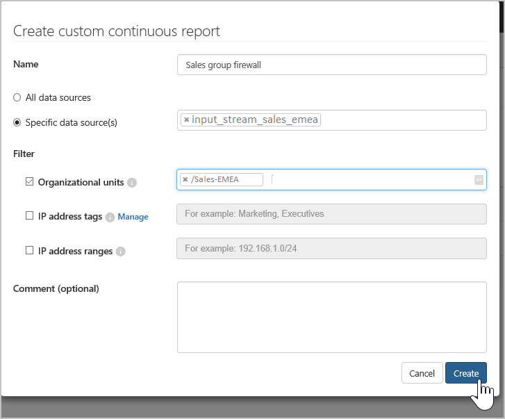

# Обнаружить

## Просмотр панели мониторинга Cloud Discovery

Панель мониторинга Cloud Discovery призвана предоставить вам более полную информацию об использовании облачных приложений в организации. С ее помощью можно мгновенно получить представление об используемых типах приложений, открытых оповещениях и уровнях риска, связанных с приложениями в организации. На ней также показано, кто наиболее активно пользуется приложениями, и приводится карта размещения приложений. На панели мониторинга Cloud Discovery много параметров фильтрации данных, позволяющих создавать конкретные представления интересующих вас данных, и наглядные графические элементы для мгновенного получения полного представления.

Чтобы получить общее представление о приложениях Cloud Discovery, сначала нужно открыть панель мониторинга Cloud Discovery и просмотреть указанные ниже данные.
 
1. Сначала изучите общие характеристики использования облачных приложений в организации в области общего обзора использования.

2. Затем перейдите на уровень ниже и просмотрите основные категории приложений, используемых в организации, для каждого из различных параметров, а также долю использования, которая приходится на санкционированные приложения.

3. Перейдите еще на уровень ниже и просмотрите приложения, относящиеся к определенной категории, с помощью мини-приложения "Обнаруженные приложения".

4. Вы можете просмотреть наиболее активных пользователей и исходные IP-адреса, чтобы узнать, кто из пользователей чаще всего пользуется облачными приложениями в организации.
5. Узнайте, как обнаруженные приложения распределены географически на карте головных офисов приложений.

6. Наконец, не забудьте проверить оценку риска обнаруженного приложения в области **обзора рисков приложений** и просмотрите состояние оповещений об обнаружении, чтобы узнать, сколько открытых оповещений следует проанализировать.
  
## Исключение сущностей  
При наличии пользователей или IP-адресов, которые вызывают слишком много оповещений либо не должны учитываться, или приложений, относящихся к другой сфере деятельности, можно исключить их данные из анализируемых данных Cloud Discovery. Например, можно исключить все данные, исходящие от 127.0.0.1 или локального узла.  
  
Создание исключения:  
  
1.  На портале под значком параметров выберите **Параметры Cloud Discovery**.  
  
2.  Откройте вкладку **Исключение сущностей**.  
  
3.  Выберите **Исключенные пользователи** или **Исключенные IP-адреса** и нажмите кнопку **Добавить пользователя** или **Добавить IP-адрес**.  
  
4.  Добавьте IP-адрес или псевдоним пользователя. Рекомендуется добавить сведения о том, почему пользователь или IP-адрес был исключен.  
  
       
  
## Управление непрерывными отчетами  
Настраиваемые непрерывные отчеты обеспечивают детальный просмотр сведений при мониторинге данных журнала Cloud Discovery в вашей организации. Создавая настраиваемые отчеты, можно фильтровать сведения по определенным географическим расположениям, сетям, объектам или подразделениям. По умолчанию в средстве выбора отчетов Cloud Discovery отображаются только следующие отчеты:  
  
-  **Глобальный отчет** объединяет на портале все сведения из всех источников данных, включенных в журналы.  
  
- **Отчет об отдельном источнике данных** содержит только сведения для конкретного источника данных.  
  
Чтобы создать непрерывный отчет, выполните указанные ниже действия.  
  
1.  На портале под значком параметров выберите **Параметры Cloud Discovery**.  
  
2.  Перейдите на вкладку **Управление непрерывным отчетом**.  
  
3.  Нажмите кнопку **Создать отчет**.  
  
4.  Введите имя отчета.  
  
5.  Выберите источники данных, которые требуется включить (все или отдельные).  
  
6.  Выберите требуемые фильтры данных: **Подразделения**, **Теги IP-адреса** или **Диапазоны IP-адресов**. Дополнительные сведения о работе с диапазонами и тегами IP-адресов см. в статье [Организация данных в соответствии с потребностями](ip-tags.md).  
  
     

## Удаление данных Deleting Cloud  
Существует ряд причин, по которым может потребоваться удалить данные Cloud Discovery. Удалять их рекомендуется в следующих случаях:  
  
-   Если вы вручную отправили файлы журнала, а с момента добавления в систему новых файлов прошло слишком много времени, и вы не хотите сохранять старые данные, которые могут повлиять на результаты.  
  
-   Новое настраиваемое представление данных применяется к новым данным только с момента своего создания, поэтому может потребоваться удалить старые данные, а затем отправить файлы журнала еще раз, чтобы позволить настраиваемому представлению использовать события из этих данных.  
  
-   Если недавно многие пользователи или IP-адреса снова начали работать после некоторого периода бездействия, их активность будет расценена как аномальная, что может привести к большому числу ложных положительных нарушений.  
  
Удаление данных Cloud Discovery:  
  
1.  На портале под значком параметров выберите **Параметры Cloud Discovery**.  
  
2.  Откройте вкладку **Удалить данные**.  
  
     Перед продолжением очень важно еще раз убедиться в том, что данные требуется удалить. Эта операция не может быть отменена и удаляет **все** данные Cloud Discovery в системе.  
  
3.  Нажмите кнопку **Удалить**.  
  
       
  
    > [!NOTE]  
    >  Процесс удаления выполняется не мгновенно, а занимает несколько минут.  

 
## См. также  
[Ежедневные мероприятия для защиты облачной среды](daily-activities-to-protect-your-cloud-environment.md)   
[Для получения технической поддержки посетите страницу службы технической поддержки Cloud App Security.](http://support.microsoft.com/oas/default.aspx?prid=16031)   
[Клиенты с поддержкой Premier также могут выбрать Cloud App Security непосредственно на портале Premier.](https://premier.microsoft.com/)  
  
  